# İşletim Sistemlerine Giriş ve Temel Kavramlar (Bölüm 1)

## 1. İşletim Sistemi Nedir? (Tarihsel ve Genel Tanım)
İlk bilgisayarlarda işlemler, delikli **kartlarla (punch cards)** manuel olarak yüklenerek yapılırdı. Daha sonra bu rutin ve yavaş işleri takip eden, donanımı otomatikleştiren bir yazılım (İşletim Sistemi) oluşturuldu.

**Günümüzde İşletim Sistemi:** Bilgisayarın sabit diskinde (HDD/SSD) depolanan ve bilgisayar açıldığında belleğe (RAM) otomatik olarak yüklenen ana programdır. (Operating System Concepts – 10th Edition 1.6 Silberschatz, Galvin and Gagne ©2018)

> 💡 **En Genel Tanım:** İşletim Sistemi (OS), bilgisayarın donanımını yöneten; bilgisayar kullanıcısı ile donanımı arasında **aracı görevi gören** ve programları çalıştırarak donanımın verimli kullanılmasını sağlayan yazılımdır.

---

## 2. İşletim Sisteminin Amaçları ve Rolleri
İşletim sistemi, her zaman arka planda çalışan ve sistemi organize eden yazılımdır. Temel 3 ana amacı vardır:

1.  **Ortam Sağlamak:** Bir bilgisayar kullanıcısının, programlarını en uygun, kolay ve verimli şekilde yürütebilmesi için platform oluşturmak.
2.  **Kaynak Tahsisi (Resource Allocator):** Gerekli görevleri gerçekleştirmek için bilgisayarın donanım kaynaklarını adil, düzenli ve verimli bir şekilde tahsis etmek (dağıtmak).
3.  **Kontrol Programı Olmak (Control Program):** İki ana işleve hizmet eder:
    *   Bilgisayarın uygunsuz kullanımını ve hataları önlemek için kullanıcı programlarının yürütülmesini denetler.
    *   I/O (Giriş/Çıkış) cihazlarıyla ilgili işlemleri yönetir ve I/O cihazlarının kontrolünü sağlar.

> ❓ **Hoca Sorabilir (Boşluk Doldurma / Açıklama):** "İşletim sistemi kaynak dağıtıcısı (____) ve denetleyici (____) olarak iki ana görev üstlenir."
> ✅ **Cevap:** **Resource Allocator** (Kaynak Paylaştırıcı) ve **Control Program** (Kontrol Programı).

### Öğrenilmesi Gereken İki Kritik Tanım:
*   **Resource Allocator:** İşletim sistemi, bilgisayarın CPU zamanı, bellek (RAM) alanı, disk alanı gibi sınırlı kaynaklarını yönetir ve bunları kullanıcı programlarına tahsis eder. Bu süreç, kaynakların adil ve verimli bir şekilde kullanılmasını sağlar.
*   **Control Program:** OS, bilgisayarın uygunsuz kullanımını ve hataları önlemek için kullanıcı programlarının yürütülmesini denetler. I/O cihazlarının kontrolünü sağlar. Bu, bilgisayarın güvenli ve stabil (kararlı) bir şekilde çalışmasına olanak tanır.

---

## 3. Bilgisayar Sisteminin Bileşenleri (4 Mantıksal Yapı)
Bir bilgisayar sistemi temelden kullanıcıya doğru 4 ayrı katmana ayrılır:

| Katman | İşlevi | Örnek |
| :--- | :--- | :--- |
| **1. Donanım (Hardware)** | Temel bilgi işlem kaynaklarını sağlar. Tüm sistemin fiziksel varlığıdır. | CPU, Bellek (RAM), Diskler, Klavye, Ekran |
| **2. İşletim Sistemi (OS)** | Donanımı kontrol eder ve uygulamalar arasında bölüştürür (Aracı katman). | Windows, Linux, Android |
| **3. Uygulama Programları** | Kullanıcının spesifik problemlerini çözen sistemin görünen yüzüdür. | Word, Chrome, Oyunlar, Derleyiciler |
| **4. Kullanıcılar (Users)** | Sistemi kullanan taraftır. | İnsanlar, makineler, başka bilgisayarlar |

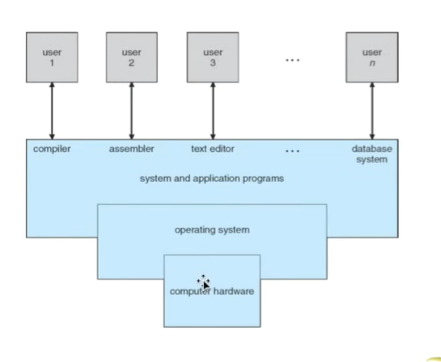

---

## 4. Çekirdek (Kernel), Sistem ve Uygulama Programları

> 🚨 **'Soru Gelir' Alarmı (Kısa Cevap / Boşluk Doldurma):** "Bilgisayarda her zaman, sistem açılışından kapanışına kadar durmadan çalışan işletim sisteminin kalbine (ana programa) ne ad verilir?"
> ✅ **Cevap:** **Çekirdek (Kernel)** denir.

İşletim sistemi ortamında bulunan programlar:
1.  **Kernel (Çekirdek):** Her zaman çalışan ana kısımdır.
2.  **Sistem Programları:** İşletim sistemiyle birlikte gelir (gönderilir), sistemi idare etmeni sağlarlar ancak çekirdeğin (kernel) *kendisinin bir parçası DEĞİLDİRLER*.
3.  **Uygulama Programları:** İşletim sistemiyle direkt ilişkisi olmayan tüm dış (sonradan kurulan) programlardır.

### Mobil İşletim Sistemleri ve Middleware (Ara Yazılım)
İşletim sistemlerinin özellikleri günümüzde sürekli artmaktadır. Özellikle mobil işletim sistemleri (iOS, Android vb.) yalnızca bir Kernel'den ibaret değildir. 
*   **Middleware (Ara Yazılım):** Aynı zamanda uygulama geliştiricilerine doğrudan veritabanları, multimedya işleme veya grafik hesaplamaları gibi ek hizmetler sağlayan bir dizi yazılım framework'ü (kütüphane altyapısı) içeren **ara yazılımdır (middleware)**.

---

## 5. Ders-1 İçin Hocanın Sorabileceği İlave Kritik Konular (Sınavlık Kavramlar)
İşletim Sistemlerine giriş derslerinin (Ders 1) klasik konuları bağlamında sorulabilecek en temel kavramlar:

### A) Kesmeler (Interrupts) ve Traps
İşletim sistemi **"Kesme Odaklı" (Interrupt-driven)** çalışır. 
*   **Donanım Kesmesi (Hardware Interrupt):** Mouse hareket ettiğinde veya diske veri geldiğinde donanımın CPU'ya gönderdiği "Bana bak, iş geldi!" elektrik sinyalidir.
*   **Yazılım Kesmesi (Trap / Exception):** Kod çalışırken yanlış işlem yapıldığında (Örn: sıfıra bölme, yetkisiz belleğe erişim), yazılımın ürettiği bir uyarıdır (exception). OS devreye girip o programı kapatır.

### B) Çift Modlu Çalışma (Dual-Mode Operation) - Güvenliğin Temeli
Hocaların çok önemsediği konudur. Sistemin çökmesini engellemek için OS iki farklı yetki modunda donanımsal bir "Mode Bit" ile yönetilir:
1.  **User Mode (Kullanıcı Modu - Bit: 1):** Sınırlı yetkiyle çalışılan moddur. Sıradan bir uygulama donanıma (disk, RAM'in geneli) kendisi doğrudan erişemez.
2.  **Kernel Mode (Çekirdek Modu - Bit: 0):** Tam yetkili (Privileged) moddur. Kritik işletim sistemi komutları ve I/O işlemleri burada yapılır.

> ❓ **Hoca Sorabilir (Açıklama):** Kullanıcı bir uygulamada (örn: Word) dosyayı kaydet dediğinde yetki süreci nasıl işler?
> ✅ **Cevap:** Uygulama (Bit:1) User Mode'da iken diske kendi yazamaz. Bunun için OS'ye bir **Sistem Çağrısı (System Call)** yapar. Donanım bunu algılayıp modu Kernel Mode'a (Bit:0) geçirir. OS işlemi güvenlik kontrolünden geçirip kalıcı diske kaydeder ve normal moda (User Mode) geri döner.

### C) Bellek Hiyerarşisi (Memory Hierarchy) Standartları
Hız, maliyet ve kalıcılık açısından hocalar bu sıralamayı testte/boşluk doldurmada sever. Kapasite büyüdükçe hız düşer.

| Bellek Türü | Hız | Kapasite / Depolama | Kalıcılık Durumu (Power Off) |
| :--- | :--- | :--- | :--- |
| **Registers (Yazmaçlar)** | En Hızlı (CPU İçi) | Çok Küçük (Byteler) | Silinir (Uçucu / **Volatile**) |
| **Cache (Önbellek)** | Çok Hızlı (SRAM) | Küçük (MB seviyesi) | Silinir (Uçucu / **Volatile**) |
| **Main Memory (RAM)** | Orta Hızlı (DRAM) | Orta Boyut (GB seviyesi)| Silinir (Uçucu / **Volatile**) |
| **SSD / Manyetik Disk** | Yavaş | Büyük (TB seviyesi) | **Kalıcı (Non-Volatile)** |

### D) Doğrudan Bellek Erişimi (DMA - Direct Memory Access)
*   **Neden Kullanılır?** Büyük miktardaki I/O verilerinin (örneğin devasa bir disk kopyalaması veya yüklemesinin) işlemciyi (CPU) sürekli meşgul etmesini önlemek içindir. 
*   **Nasıl Çalışır?** Cihaz kontrolcüsü (Device Controller) veriyi CPU'ya uğramadan DOĞRUDAN ana belleğe (RAM'e) bloklar halinde aktarır. Sadece blok bittiğinde işlemciye tek bir Kesme (Interrupt) atılır.

---

## 6. Özet: Niye İşletim Sistemine İhtiyacımız Var?
İşletim sistemleri, bilgisayarın donanımını yönetmenin yanı sıra, kullanıcıların bilgisayarı daha kolay ve verimli bir şekilde kullanmalarını sağlar.
*   Kullanıcıların **dosyaları yönetmelerine**,
*   Çeşitli **programları çalıştırmalarına**,
*   Aynı anda çalışırken (Concurrency) **bilgisayarın kaynaklarını paylaşmalarına** olanak tanır.
*   Ayrıca, donanımın birbirine girmemesi ve programların birbirini bozmaması için **çeşitli güvenlik önlemleri** içerir (Mode Bit, Memory Protection).


 # İşletim Sistemi Servisleri ve Yapıları (Bölüm 2)

## 1. İşletim Sistemi Servisleri (Hizmetleri)
İşletim sistemi, uygulamaların çalışması için bir ortam sağlar.

> 💡 **Mantıksal Benzetme:** Bunu bir restoran gibi düşün; mutfak (hardware/donanım) orada durur ama garson (İşletim Sistemi - OS) olmadan sipariş veremezsin. Hangi uygulamaların hangi kaynağı kullanacağını garson yönetir.

*   **Kullanıcı Arayüzleri:**
    *   **CLI (Komut Satırı Müşterekliği):** Sadece yazı yazarak komut verdiğin arayüz ("Hacker" ekranı gibi, cmd, bash vb.).
    *   **GUI (Grafiksel Arayüz):** Mouse ile pencerelere tıkladığın, hepimizin genellikle kullandığı görsel ekran.
*   **Temel İşlemler (OS Servisleri):** Program çalıştırma, I/O işlemleri (yazıcıdan çıktı alma, klavye okuma), dosya/sistem yönetimi (okuma, yazma, silme) ve hata tespiti/yönetimi.

---

## 2. Sistem Çağrıları (System Calls) ve API - 🚨 KRİTİK KONU!
"Bir uygulama donanıma nasıl erişir?" sorusu İşletim Sistemleri derslerinin en sevilen konularındandır.

### Donanıma Neden Doğrudan Erişemeyiz?
> ❓ **Hoca Sorabilir (Açıklama):** "Kullanıcı uygulamaları neden doğrudan donanıma erişemez?"
> ✅ **Cevap:** Asıl sebep **Koruma ve Güvenlik**tir. Eğer her uygulama kafasına göre donanıma (hard disk, bellek) erişseydi, bir virüs veya hatalı kod tüm sistemi silebilir ya da diğer programların verilerini çalabilirdi. İşletim sistemi kaynaklara erişimi kontrol ederek koruma (Protection) sağlar.

### System Call (Sistem Çağrısı) Nedir?
Uygulama ile donanım arasında yasal ve güvenli bir sınır kapısı (Filtre) görevi görür. (User Mode'dan -> Kernel Mode'a geçişi tetikler). İşletim sistemi gelen isteği inceler, uygun bulursa erişim hakkı verir.
*   **Benzetme:** Bankaya gittiğinde kasaya doğrudan giremezsin. Gişe memuruna (**System Call**) bir talep iletirsen (**API**), o senin adına parayı kasadan (**Hardware**) alır.
*   **Sınav Detayı:** Bir dosyayı sadece kopyalamak gibi çok basit görünen bir işlemde bile arka planda **onlarca sistem çağrısı** (dosyayı aç, belleğe oku, hedefe yaz, kapat vb.) arka arkaya çalışır.

### API (Application Programming Interface) Nedir?
Programcılar sistem çağrılarını doğrudan, tek tek, manuel yazmazlar. Bunun yerine **API (Örn: Win32, POSIX, Java API)** kullanırlar.

> ❓ **Hoca Sorabilir (Boşluk Doldurma / Açıklama):** "Sistem çağrıları yerine neden API tercih edilir?"
> ✅ **Cevap:** **Taşınabilirlik (Portability)** ve **Kullanım Kolaylığı** sağlar. API'ler donanımın karmaşıklığını gizler. Yazdığın kod, o API'yi destekleyen farklı işletim sistemlerinde sorunsuzca çalışabilir.

---

## 3. Kavram Karşılaştırmaları (Boşluk Doldurma Bankoları)

| Kavram 1 | Kavram 2 | Temel Farkı / Özelliği |
| :--- | :--- | :--- |
| **Linker (Bağlayıcı)** | **Loader (Yükleyici)** | **Linker**, derlenmiş kodları ve kütüphaneleri birleştirir; **Loader** ise bu birleşmiş çalıştırılabilir programı hafızaya/belleğe (**RAM'e**) taşır (yükler). |
| **Message Passing** | **Shared Memory** | **Message Passing (Mesajlaşma)** OS (Kernel) aracılığıyladır. **Shared Memory (Paylaşılan Bellek)** doğrudan bellek (RAM) üzerindendir. |
| **Policy (Politika)** | **Mechanism (Mekanizma)** | **Policy**, uygulamanın **"NE yapılacağını"** (what) belirler; **Mechanism**, donanımın/sistemin bunu **"NASIL yapacağını"** (how) belirler. |
| **API** | **ABI** | **API** yazılım/kod katmanındaki arayüzdür. **ABI** ise **Donanım seviyesindeki standarttır** (Parametrelerin registerlara nasıl dizileceğini belirler). |

---

## 4. İşletim Sistemi Yapıları (Mimari Farklar)
Hocaların mimari farklarını, "Hangisi avantajlıdır, dezavantajı nedir?" şeklinde sormayı çok sevdiği yerdir.

| Mimari Yapı | Temel Mantığı | Avantajı (Neden Kullanılır?) | Dezavantajı |
| :--- | :--- | :--- | :--- |
| **Monolitik (Monolithic)** | Her şey (sürücüler, dosya sistemi vb.) tek bir büyük çekirdek parçası içindedir. (Örn: Orijinal UNIX, eski Linux) | Çalışması **çok hızlıdır**. İletişim genel bellek üzerinden anında yapılır. | Bir modül/sürücü bozulursa/çökerse **tüm sistem çökebilir (Kernel panic)**. Hata bulmak zordur. |
| **Mikroçekirdek (Microkernel)** | Çekirdek (Kernel) olabildiğince küçültülür (sadece asıl CPU/RAM planlaması kalır). Servisler bağımsız, "kullanıcı modunda" çalışır. | **Çok güvenlidir.** Çoğu servis kernel dışında olduğu için, bir servis çökerse işletim sisteminin kalbi (kernel) ayakta kalır. | Servisler arası iletişim "Mesajlaşma (Message Passing)" ile yapıldığı için çok fazla mod geçişi olur, **performans düşer (Darboğaz/Bottleneck).** |
| **Katmanlı (Layered)** | Sistem OSI modelindeki gibi soğan tarzı katman katmandır. Her katman sadece bir altındakini kullanabilir. | Katmanlar izole olduğu için **Debug etmesi (hata bulması ve test etmesi) çok kolaydır.** | Bir işlem birçok katmandan geçmek zorunda olduğu için **performans en düşüktür.** |

> 💡 **Bilgi Kartı: LKM (Loadable Kernel Modules)**
> Modern sistemlerin (bugünkü Windows, Linux vb.) işletim sistemine çalışma anında, **sistemi hiç yeniden başlatmadan** (dinamik olarak) yeni özellik (genellikle Driver/sürücü) eklemesini sağlayan modüllerdir. 

---

## 5. Sistemi Başlatma (Booting) ve Hata Yönetimi
Bilgisayarın güç düğmesine bastığında neler oluyor? Bu akış sıralama veya görev sorusu olarak gelebilir:

1.  **BIOS / UEFI Yüklemesi:** İlk donanım tespiti yapılır. BIOS sabit diskteki boot block kısmını yükler. Modern sistemlerde BIOS'un yerini çok daha hızlı olan **UEFI** almıştır.
2.  **Bootstrap Loader:** Asıl işi yapan budur. ROM veya EEPROM üzerindeki bu küçük program donanımı kontrol edip uyandırır ve işletim sisteminin kalbini **(Kernel'ı) belleğe (RAM) taşır / yükler.**
3.  **GRUB:** Özel olarak Linux vb. sistemlerde en popüler ve sık duyacağın gelişmiş cihaz başlatıcısı/bootloader'dır.

### Hata Yönetimi (Error Detection) Terimleri
Doğrudan donanım erişimi serbest olsaydı, sızıntı bir program tüm makineyi çökertebilirdi (crash). İşletim sistemi süreci yönetirken sistemin direncini korur. İki önemli kavram:

*   **Core Dump:** Bir sürecin (Process/uygulama) hata verip çökmesi anında, bellekte kapladığı alanın (kullanıcı alanı hatası) hata ayıklamak için dosyaya dökülmesidir.
*   **Crash Dump:** İşletim sisteminin KENDİSİNDE (**Kernel seviyesi hatası**) meydana gelen ölümcül bir çöküş sonucu durumun kaydedilmesidir (Örn. Mavi Ekran).

---

### 📝 Özet: Sınav Öncesi Son Kontrol
*   **Sistem Çağrısı:** Uygulamanın User Mode'dan kernel'a geçiş yapıp donanımla konuşma biletidir.
*   **Mikroçekirdek:** Çökmelere dayanıklı ve esnektir ama **mesajlaşma (Message passing)** trafiğinden dolayı performans düşüklüğü yaşar.
*   **Darboğaz (Bottleneck):** Mikroçekirdekte User mode <-> Kernel mode geçişlerinin yarattığı performans sıkıntısıdır.
*   **API Anahtar Kelimeleri:** Taşınabilirlik (Portability) ve programcı için kullanım kolaylığı.
*   **Bootstrap / Bootloader:** Sistemi uykudan kaldıran ve Çekirdeği donanımdan RAM'e kopyalayan fedakar program.

# Süreçler (Processes) Yönetimi ve Temel Kavramlar

## 1. Proses Nedir? (Program vs. Proses)
En temelden başlayalım: 
*   **Program:** Bilgisayarında duran (hard diskte) pasif bir kod yığınıdır (Örn: `chrome.exe` dosyası). Ne zaman ki sen ona çift tıklarsın ve o belleğe (RAM) yüklenip çalışmaya başlar, işte o zaman adı Proses olur.
*   **Proses:** Programın belleğe (RAM) yüklenip çalışmaya başlamış halidir. 

| Kavram | Özellik |
| :--- | :--- |
| **Program** | Pasiftir, depolama alanında bekler. |
| **Proses** | Aktiftir, CPU ve bellek kullanır. |

### Process Kavramı
Bir işletim sistemi çeşitli programları yürütür. İlk bilgisayarlar, işleri toplu yürüten batch sistemlerdi, ardından kullanıcı programlarını veya görevlerini time-shared (zaman paylaşımlı) olarak çalıştıran sistemler ortaya çıktı.

*   **Batch systems:** Batch sisteminin kullanıcıları, bilgisayarla doğrudan etkileşime girmezlerdi. Her kullanıcı işini delikli kartlar (punch cards) gibi çevrimdışı bir cihazda hazırlar ve bilgisayar operatörüne sunardı. İşlemeyi hızlandırmak için benzer ihtiyaçlara sahip işler bir araya toplanır ve grup olarak çalıştırılırdı. Batch sistemlerde mekanik I/O cihazlarının hızı CPU'dan çok yavaş olduğu için CPU genellikle boştadır.
*   **Time-shared:** Birden fazla proses, CPU tarafından aralarında geçiş yapılarak yürütülür, ancak bu geçişler o kadar sık gerçekleştirilir ki kullanıcı bunu fark etmez. Böylece CPU'nun boşta kaldığı zaman azaltılmış olur.

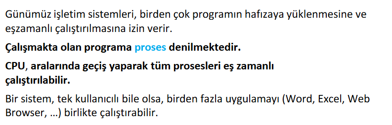
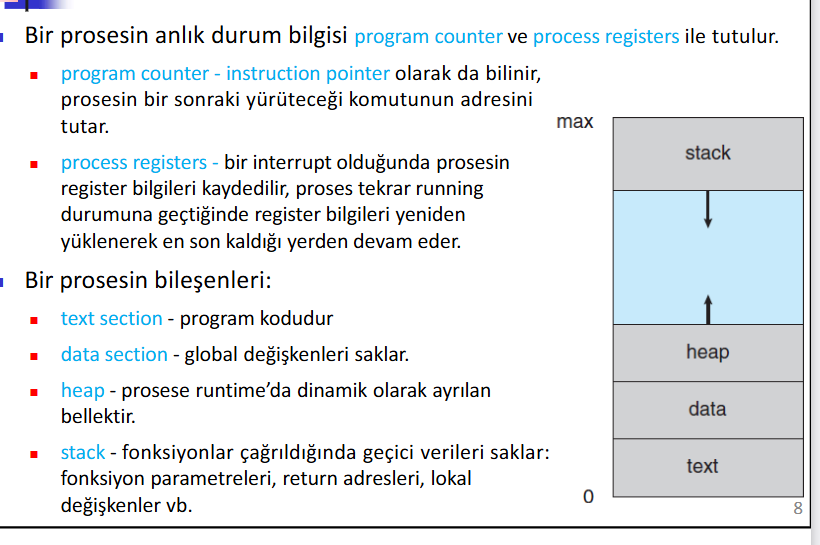
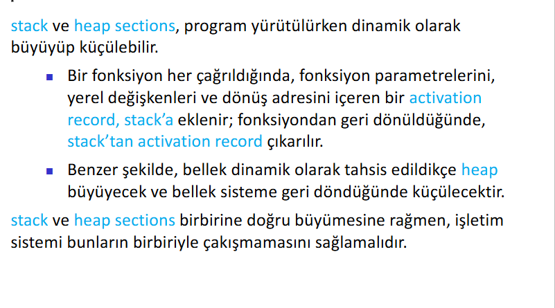

> 💡 **Mantıksal Benzetme:** Programı bir yemek tarifi kitabı gibi düşün. Kitap rafta dururken kimseyi doyurmaz (pasif). Proses ise o tarife bakarak mutfakta yemek pişirme eylemidir. Ocak (CPU) kullanılır, malzemeler (Hafıza) harcanır ve ortaya bir ürün çıkar (aktif).

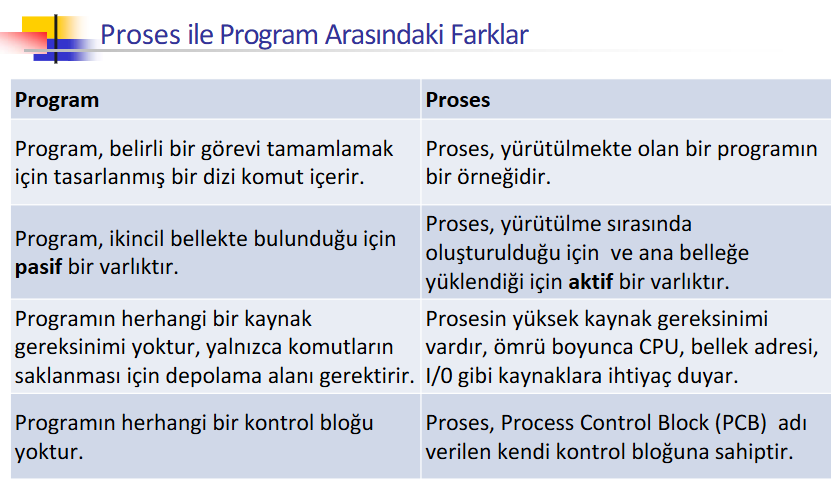

---

## 2. Bir Prosesin Bellek Yapısı (Memory Layout)
Bir programı çalıştırdığında, işletim sistemi ona belli bir bellek alanı ayırır. Ancak bu alanın içindeki **Stack** ve **Heap** kısımları sabit değildir; programın o anki ihtiyacına göre değişirler.

| Bölüm | Özellikler |
| :--- | :--- |
| **Text** | Programın kodu burada durur (Sabittir). |
| **Data** | Global ve statik değişkenler buradadır (Sabittir). |
| **Heap (Öbek)** | Çalışma anında (runtime) dinamik olarak ayrılan bellek (Örn: `malloc()` ile alınan yer). İsteğe göre büyür veya küçülür. Dinamik bellek ayırma burada yapılır. |
| **Stack (Yığın)** | Fonksiyon çağrıları, yerel değişkenler ve dönüş adresleri/parametreleri burada tutulur. "Geçici iş listesi" gibidir. Proses çalıştıkça büyür ve küçülür. |

### "Birbirine Doğru Büyümek" Ne Demek?
Bu kısımları birbirine zıt yönlerden büyüyen iki grup gibi hayal et. Genelde Stack yukarıdan aşağıya, Heap ise aşağıdan yukarıya doğru genişler. Ortadaki boş alan hangisine lazımsa o oraya doğru genişler.
*   **Neden böyle?** Belleği en verimli bu şekilde kullanırız. 
*   **İşletim Sisteminin Görevi:** Bu ikisi ortada buluşup birbirinin üstüne binmemelidir. Eğer çakışırlarsa sistem çöker (meşhur **Stack Overflow** hatası).

> 🧠 **Akılda Kalıcı Kodlama: "KAB" Formülü**
> Prosesin ihtiyaç duyduğu 3 temel şey:
> 1. **K**aynak (CPU, I/O)
> 2. **A**dres Alanı (Bellek)
> 3. **B**lok (PCB - Process Control Block)

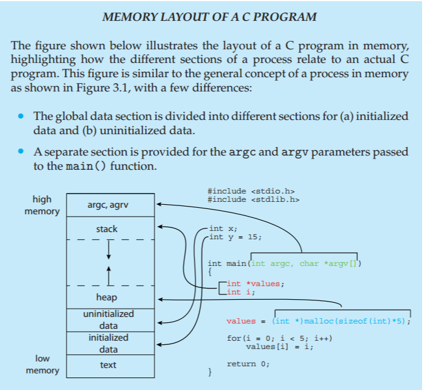
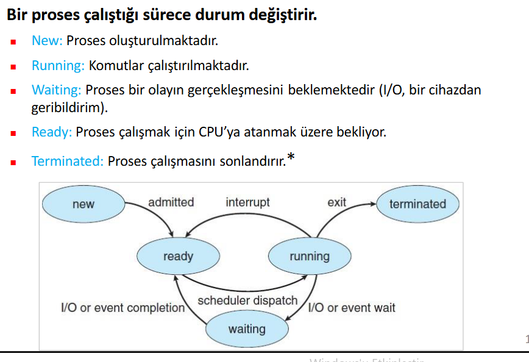

> 🚨 **'Soru Gelir' Alarmı:** Bir proses belleğe yüklendiğinde dört ana bölmeye ayrılır.
> *   "Hangi bölümler dinamik olarak büyür?" **Cevap:** Stack ve Heap.
> *   "Fonksiyon parametreleri nerede tutulur?" **Cevap:** Stack.
> *   "Dinamik bellek ayırma nerede yapılır?" **Cevap:** Heap.
> *   "Kodda bölgeleri işaretlenmiştir, açıkla?" **Cevap:**  Heap ve stack birbirine doğru büyürler, böylece bellek daha verimli kullanılır. Ancak bu iki bölme birbirine çok yaklaşırsa, yani birbirlerinin alanını işgal etmeye başlarsa, bu durum "stack overflow" hatasına yol açar ve sistem çöker.

---

## 3. Proses Durumları (Process States)
Bir proses hayatı boyunca şu beş durumdan geçer. Bunu bir banka kuyruğu gibi hayal et:

| Durum | Açıklama | Banka Kuyruğu Benzetmesi |
| :--- | :--- | :--- |
| **New** | Bebek proses, yeni oluşturuluyor. | Banka kapısından girmek. |
| **Ready** | "Ben hazırım, CPU boşalınca beni alın" diyenlerin sırası. | Sıra numaranı alıp beklemek. |
| **Running** | Şu an CPU'da koşan, işlem yapan proses. | Gişede işlem yaptırmak. |
| **Waiting** | Bir olayı (mes. kullanıcının tuşa basmasını) bekleyen proses. | İmza için evrak beklemek üzere kenara geçmek. |
| **Terminated** | İşi bitti, sistemden temizleniyor. | İşlemi bitirip bankadan çıkmak. |

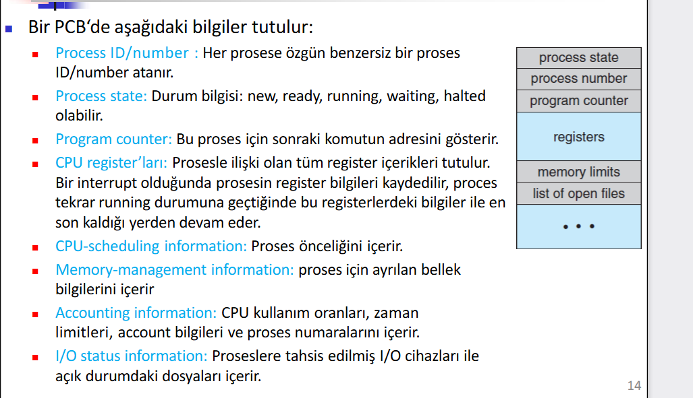

---

## 4. PCB (Process Control Block) ve Thread
**PCB**, prosesin "duraklat/devam et" düğmesidir (kimlik kartı). İçinde **Program Counter** (sıradaki komut/satır), Process State (durum), açık dosyalar ve bellek bilgileri bulunur. 

*   **"Durdurulmamış Gibi Devam Etmek":** CPU müzikten ayrılıp Word'e geçeceği zaman Müzik prosesinin nerede kaldığını PCB'sine yazar. Tekrar ona döndüğünde PCB'yi okur ve hiç durmamış gibi devam eder.
*   **Merkezi Rol:** İşletim sisteminin zamanlayıcıları bir karar vereceği zaman hemen PCB'ye bakar.
*   **Not:** Linux'ta her proses, C dilindeki `struct task_struct` adı verilen bir yapı ile temsil edilir. Aktif prosesler çift yönlü bağlı liste (Doubly Linked List) içinde tutulur.

> 💡 **Mantıksal Benzetme: "Mutfak Sipariş Fişi"**
> Aşçısın (CPU). 10 masanın siparişi (Prosesler) geliyor. Her masanın sipariş fişi (PCB) var. Bir yemeği ızgaraya attın, pişerken fişine not düşersin (Waiting). O sırada diğer masanın siparişini hazırlarsın. Köfte pişince duruma göre tabağa alırsın. Fiş (PCB) olmasa hangi masanın ne aşamada olduğunu asla hatırlayamazdın.

### Thread Kavramı
*   Tek thread ile bir proses kontrol edilir ve birden fazla görev aynı anda yapılamaz (bir Word programında karakter girişi ile yazım denetleyici aynı anda yapılamaz).
*   Modern işletim sistemlerinde bir proses ile birden fazla thread çalıştırılmasına izin verilir. Bu özellik multicore işlemcilerde çok faydalıdır ve birden çok görev eşzamanlı (concurrency) yapılabilir.
*   Birden çok thread ile çalışan sistemlerde, PCB ile her bir thread’e ait bilgiler saklanır.

---

## 5. Multiprogramming ve Time-Sharing

| Terim | Temel Amaç | Özellik |
| :--- | :--- | :--- |
| **Multiprogramming (Çoklu Prog.)** | CPU kullanımını maksimize etmek. | Proses I/O beklerken, CPU hemen başka prosese geçer. |
| **Time-Sharing (Zaman Paylaşımı)** | Kullanıcı etkileşimi (interaction) sağlamak. | Geçişler o kadar hızlıdır ki kesintisiz çalışma hissi verilir. |

### Process Scheduler (Zamanlayıcı)
CPU'nun başına kimin geçeceğine karar veren "trafik polisi"dir. Bu mekanizma sayesinde sistem verimli çalışır.

> 🚨 **'Soru Gelir' Alarmı:**
> *   **Soru:** Dört çekirdekli (quad-core) işlemcide aynı anda en fazla 1 proses mi yürütülebilir? **Cevap:** Yanlış. Her CPU çekirdeğinde 1 proses çalışabilir, bu yüzden multicore bir sistemde aynı anda birden çok proses çalışabilir.
> *   **Soru:** Zaman paylaşımlı sistemlerde çok sık yer değiştirilmesinin temel sebebi nedir? **Cevap:** Kullanıcının her programla etkileşime girebilmesini sağlamaktır.
> *   **Soru:** Bir proses CPU'da çalışırken "klavyeden bir veri gelmesini" beklediğinde, CPU boşa gitmesin diye başka prosese geçilmesine ne ad verilir? **Cevap:** Multiprogramming.

---

## 6. Process Scheduling (Zamanlama Kuyrukları)
Bir proses farklı kuyruklara alınabilir, bu seçim **scheduler** (zamanlayıcı) tarafından gerçekleştirilir.

| Kuyruk Adı | İşlevi | Benzetme |
| :--- | :--- | :--- |
| **Job Queue (İş Kuyruğu)** | Sistemdeki tüm proseslerin listesidir. | Hastaneye kayıt yaptıran herkes. |
| **Ready Queue (Hazır Kuy.)** | Sadece CPU'yu bekleyen, hafızaya yüklenmiş prosesler. | Her şeyiyle hazır, muayene odasına girmeyi bekleyen hasta. |
| **Device Queue (Bekleme/Cihaz)** | I/O (klavye/disk vb.) bekleyen prosesler. | Röntgen cevabını bekleyen hasta. |

*   **Long-term scheduler (job scheduler):** Diskteki işleri seçerek hafızaya yükler. Dakikalık aralıklarla çalışır.İş kuyrugunda hangı processlerin hazır kuyruguna gecerıne karar verir. CPU'ya gelen proseslerin sayısını kontrol eder, böylece multiprogramming derecesini belirler.
*   **Short-term scheduler (CPU scheduler):** Hazır olanları seçerek CPU’yu onlara tahsis eder. Çok sık (<100ms) çalışır.
*   **Medium-term scheduler:** Bellek aşırı yüklendiğinde bazı prosesleri geçici olarak diske atar (swapping) ve CPU için rekabeti azaltır.

### CPU-bound vs I/O-bound Prosesler

| Proses Tipi | Özellik | Restoran Benzetmesi |
| :--- | :--- | :--- |
| **I/O-bound** | Bekleme süresi çok, hesaplama az. Zamanını I/O bekleyerek geçirir. | Yemeğini yemiş, kahvesini yudumlayan (garson bekleyen) müşteri. |
| **CPU-bound** | Hesaplama çok, bekleme az. | Çok aç gelmiş, sürekli yemek yiyen ve mutfağı meşgul eden müşteri. |

*Not: Sistemin dengeli çalışması için zamanlayıcı bu ikisini karışık (mix) seçmelidir. Sadece CPU-bound proses varsa I/O birimleri boş kalır, israf olur.*

### Swapping ve Medium-Term Scheduler
Bellek aşırı yüklendiğinde yer açmak (sistemi rahatlatmak) için bazı prosesleri geçici olarak diske/HDD'yekoridora çıkarmak işlemine **Swapping** denir. Bu işlemi **Medium-term Scheduler** yapar. Bu işlem sonucunda CPU için rekabet edemez hale gelir, ve **multiprogramming derecesi düşürülür.**

---

## 7. Context Switch
Bir prosesin CPU’da yürütülürken başka bir prosesin CPU’ya geçmesine karar verildiğinde çıkacak prosesin (context) bilgilerinin kaydedilmesi ve CPU'ya geçecek prosesin bilgilerinin yüklenmesine denir.

*   Context bilgisi **PCB** içerisinde saklanır.
*   Context switch süresi, bu geçişte bir iş üretilmediği için **Overhead (ek yük)** olarak adlandırılır. Donanımın kalitesi süreyi kısaltır.
*   Bazı donanımlarda her CPU için birden çok register seti sağlanır ve pointer'in değiştirilmesiyle daha pratik yapılır.

---

## PCB ve Context Switch Arasındaki İlişki
*   **PCB (Process Control Block):** Her prosesin kendine ait bir PCB'si vardır. Bu blok, prosesin durumunu, program sayacını, CPU register'larını, açık dosyaları ve diğer önemli bilgileri içerir.
*   **Context Switch:** Bir proses CPU'dan çıkarılırken, o prosesin PCB'sindeki bilgileri kaydedilir. Yeni proses CPU'ya geldiğinde, onun PCB'sindeki bilgiler yüklenir. Bu sayede her proses kendi durumunu korur ve kesintisiz çalışıyormuş gibi devam eder.

 **Soru:** Context switch sırasında hangi bilgiler kaydedilir ve yüklenir? **Cevap:** Program sayacı (PC), CPU register'ları, proses durumu, açık dosyalar ve diğer önemli bilgiler PCB'de saklanır ve context switch sırasında bu bilgiler kaydedilir ve yüklenir.

 **Soru:** Context switch süresi neden overhead olarak adlandırılır? **Cevap:** Çünkü context switch sırasında CPU'nun gerçek bir iş yapmadığı, sadece prosesler arasında geçiş yaptığı için ek bir yük (overhead) oluşturur. Bu süre, sistem performansını etkileyebilir ve mümkün olduğunca kısa tutulmalıdır.

 --- 

## 8. Proseslerin Doğumu (Process Creation)
*   **Anne-Çocuk İlişkisi:** Bir proses (Parent), başka yeni prosesler (Child) oluşturabilir (Process Tree oluşur).
*   **PID (Kimlik):** Her prosese benzersiz PID verilir. Kaynaklar OS tarafından tahsis edilebilir veya babasından aktarılabilir.

> 🚨 **"fork()" Fonksiyonunun "Sihirli" Dönüş Değeri**
> `fork()` çağrıldığında sistemde iki tane olay oluşur ama dönüş değerleri farklıdır:
> *   **Parent (Baba):** Yeni oluşturulan çocuğun PID numarasını döndürür. (0'dan büyüktür).
> *   **Child (Çocuk):** 0 döndürür.
> *   **Hata Durumu:** Eğer -1 dönerse, çocuk oluşturulamamış demektir.

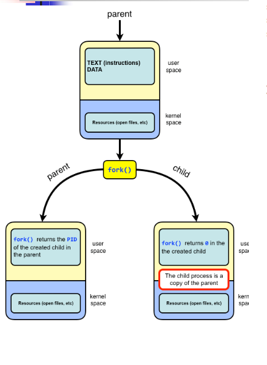
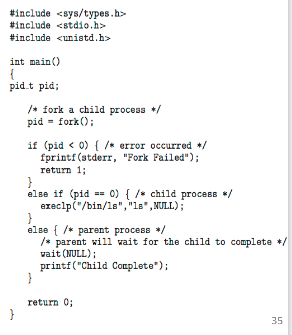

**Neden if-else yapısı var?**
*   `pid == 0` (Çocuk tarafı): Çocuğa `execlp()` gibi bir komutla yeni görev verilir.
*   `else` (Baba tarafı): Baba `wait(NULL)` komutunu kullanır. Çocuk bitirmeden baba devam ederse çocuk "yetim" kalmasın diye bekler. `wait` komutu, prosesin bitmesini bekler ve kaynakları temizler.

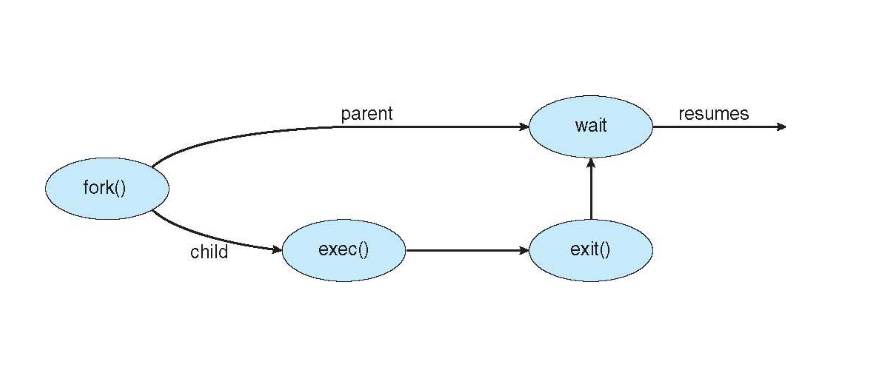

---

## 9. Proseslerin Ölümü (Termination)
1.  **Gönüllü Ölüm (`exit()`):** İşini bitirip silinmeyi ister. Durum bilgisini `wait()` ile babasına iletir.
2.  **Zoraki Ölüm (`abort()`):** Baba çocuğu zorla sonlandırabilir (örn. kaynak tüketiyorsa).
3.  **Kademeli Sonlandırma (Cascading Termination):** Baba öldüğünde sistemin tüm çocuklarının da otomatik öldürülmesidir.

### Zombie ve Orphan (Zombi ve Yetim) Proses

| Kavram | Durum | Ne Olur? | Restoran Benzetmesi |
| :--- | :--- | :--- | :--- |
| **Zombie (Zombi)** | Çocuk öldü, babası henüz `wait()` demedi. | Tabloda giriş kaplar. Baba `wait()` dediğinde tamamen yok olur. | Garson gelmeden temizlenmeyen, kirli masanın dolu gözükmesi. |
| **Orphan (Yetim)** | Çocuk yaşıyor, ama babası hesabı ödemeden (wait() çağırmadan) öldü. | `init` (root) prosesi periyodik `wait()` çağırıp onu evlat edinir ve temizler. | Babanın hesabı ödemeden kaçıp, restoran sahibinin hesabı devralması. |

> 🧠 **Şifreleme: "BA-YE-ZO-BE"** = **BA**ba öldüyse çocuk **YE**tim (Orphan) kalır, **ZO**mbi ise çocuk bitti ama **BE**klemededir.
> *Soru: "Bütün prosesler kısa süreliğine zombi olur mu?"* Evet.

---

## 10. Chrome'un Üç Silahşörü (Proses Türleri)
1.  **Browser Process (Ana Yönetici):** Kullanıcı arayüzü, diski ve ağı yönetir.
2.  **Renderer Process (Görselleştirici):** Sayfa HTML ve JavaScript içini işler. Açtığın her sekme için ayrı oluşturulur.
3.  **Plug-in Process (Eklenti):** Flash veya eklentiler için ayrı proses.

*   **Avantaj: Hata İzolasyonu** (sekme çökerse diğerleri sapasağlam kalır) ve **Güvenlik/Sandbox** (ağ/disk kısıtlı kum havuzunda virüs engellenir).

---

## 11. Prosesler Arası İletişim (IPC)

| Model | Mantık | Hız & Özellik |
| :--- | :--- | :--- |
| **Shared Memory (Paylaşılan Bellek)** | Hafızada ortak bölge (not defteri) belirlenir. | **Çok hızlıdır.** "Aynı anda yazma" sorunu (conflict) vardır, senkronizasyon gerekir. |
| **Message Passing (Mesajlaşma)** | Prosesler birbirine mesaj (send/receive) atar. | **Düşük hız**, çünkü proses kernel (çekirdek) araya girer. Dağıtık ağ sistemlerinde çok iyi ve güvenlidir. |

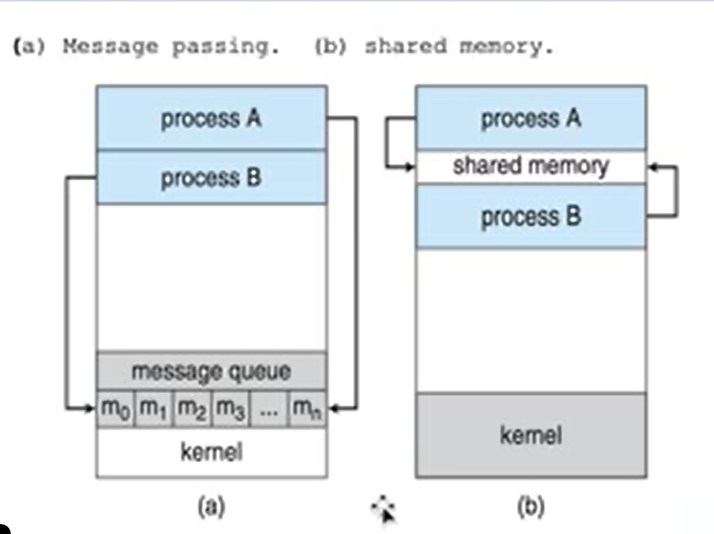

--- 

### Producer-Consumer (Üretici-Tüketici) Problemi
Paylaşılan bellek mantığının en somut örneğidir.
*   **Producer (Üretici):** Veri üreten proses (Örn: Fırıncı).
*   **Consumer (Tüketici):** Veriyi kullanan proses (Örn: Müşteri).
*   **Buffer (Tampon Bölge):** Ortada beklenen depo (Örn: Ekmek Dolabı).
*   **Senkronizasyon şarttır:** Üretici depo doluyken taşmamalı, tüketici depo boşken olmayan malı almaya çalışmamalı.

* Producer 
item next_produced; 
while (true) { 
/* produce an item in next produced */ 
while (((in + 1) % BUFFER_SIZE) == out) 
; /* do nothing */ 
buffer[in] = next_produced; 
in = (in + 1) % BUFFER_SIZE; 
}
55
* Consumer
item next_consumed; 
while (true) {
while (in == out) 
; /* do nothing */
next_consumed = buffer[out]; 
out = (out + 1) % BUFFER_SIZE;
/* consume the item in next consumed */ 
} 
56


**Buffer Türleri:**
1.  **Unbounded Buffer (Sınırsız Depo):** Boyutu pratikte sınırsızdır. Üretici hiç beklemez, her zaman yeni mal üretir. Tüketici sadece boşsa bekler.
2.  **Bounded Buffer (Sınırlı Depo):** Sabit kapasite vardır. Depo doluysa üretici bekler. Depo boşsa tüketici bekler.


# Bölüm 4: İş Parçacıkları (Threads) ve Çok Çekirdekli Programlama

## 1. İş Parçacığı (Thread) Nedir? Genel Bakış ve Analoji
Günümüzdeki modern bilgisayarlarda ve mobil cihazlarda çalışan uygulamaların çoğu **çoklu iş parçacıklı (multithread)** bir yapıya sahiptir.

**Thread (İş Parçacığı):** Merkezi işlem biriminin (CPU) kullanımındaki en temel ve en küçük yürütme birimidir. 
*   Her bir Thread kendine ait; **Thread ID, Program Counter (PC), bir grup Register (Yazmaç) ve Stack (Yığın)** yapısına sahiptir.
*   **Paylaşılanlar:** Aynı process (işlem) içindeki thread'ler process'in **kodunu (code), veri alanını (data) ve diğer sistem kaynaklarını (ör: açık dosyalar)** ortaklaşa kullanırlar.

> 💡 **Analoji (Restoran Mutfağı):** 
> Bir sürecin (Process) koca bir "Restoran Mutfağı" olduğunu düşünelim. Mutfaktaki tezgahlar, dolaplar ve malzemeler process'in hafızasıdır (Bellek / Data). "Thread"ler ise bu mutfakta çalışan **Aşçılardır**. 
> Her aşçı aynı anda farklı bir yemek yapabilir (Biri çorba karıştırır, diğeri sebze doğrar). Mutfak kaynaklarını kendi aralarında paylaşarak işi çok daha hızlı ve paralel (veya eşzamanlı) bitirirler.

---

## 2. Multithread (Çoklu İş Parçacığı) Programlamanın 4 Avantajı
Uygulamaların tek process içinde birden çok iş parçacığıyla tasarlanmasının ana sebepleri:

1.  **Responsiveness (Cevap Verebilirlik):** Bir thread bloke olsa veya uzun bir hesaplama yapsa bile, uygulamanın diğer kısmı çalışmaya devan eder. (Örn: Word'de metin girilirken arkaplanda imla denetimi yapan thread).
2.  **Resource Sharing (Kaynak Paylaşımı):** Process'ler kendi aralarında iletişim için paylaşımlı belleğe (shared memory) veya mesajlaşmaya ihtiyaç duyarken; aynı process içindeki Thread'ler varsayılan olarak **belleği ve kaynakları otomatik paylaşırlar**.
3.  **Economy (Ekonomi):** Yeni bir tam process oluşturmak, bellek ve kaynak tahsisi gerektirdiği için çok maliyetli iken; aynı kodu/veriyi paylaşan bir **Thread oluşturmak ve Thread arası bağlam geçişi (Context Switch) yapmak çok daha hızlı ve maliyetsizdir**.
4.  **Scalability (Ölçeklenebilirlik):** Çok işlemcili (Multiprocessor / Multicore) donanımlarda farklı thread'ler farklı çekirdeklerde **paralel** olarak çalışarak işlem gücünden tam faydalanır.

> ❓ **Hoca Sorabilir (Kısa Cevap / Avantajlar):** "Process oluşturmak yerine neden Thread oluşturmak daha ekonomiktir?"
> ✅ **Cevap:** Çünkü thread'ler ait oldukları process'in bellek adres alanını ve kaynaklarını ortak kullanırlar. Yeniden bellek/alan tahsisi gerekmediği için Thread oluşturmak ve iki Thread arasında bağlam geçişi (Context Switch) yapmak, tam bir Process oluşturmaktan ve process'ler arası geçişten kat kat daha az maliyetli/hızlıdır.

---

## 3. Çok Çekirdekli (Multicore) Programlama ve Temel Zorluklar

Tek bir elektronik çip içerisine birden fazla çekirdek (core) yerleştirilmiş sistemlere multithreaded yaklaşımlar büyük güç katar. Ancak bu gücü kullanabilmek için programcıların aşması gereken **5 temel zorluk** vardır:
1.  **Identifying Tasks (Görevlerin Belirlenmesi):** Hangi alt görevlerin birbirinden bağımsız eşzamanlı çalışacağının tespit edilmesi.
2.  **Balance (Dengeleme):** Belirlenen görevlerin aynı iş yükünde ve eşit oranda dağıtılması.
3.  **Data Splitting (Veri Bölme):** Farklı çekirdeklerde işlenecek verinin görevlere uygun şekilde parçalanması.
4.  **Data Dependency (Veri Bağımlılığı):** Görevler arası veri bağımlılıklarında, bir görev diğerinden senkronizasyon bekliyorsa bu sürecin (synchronous) dikkatlice ayarlanması.
5.  **Testing and Debugging (Test ve Hata Ayıklama):** Birçok farklı yürütme yolunun ihtimali olduğu için, sıralı koda kıyasla hatanın (bug) bulunup düzeltilmesinin çok zor olması.

---

### Eşzamanlılık (Concurrency) vs Paralellik (Parallelism) Karşılaştırması

> ❓ **Hoca Sorabilir (Karşılaştırma):** "Eşzamanlı (Concurrent) yürütme ile Paralel (Parallel) yürütmenin farkı nedir?"
> ✅ **Cevap:** Paralellikte birden fazla görev **aynı zaman diliminde (aynı anda) farklı donanım çekirdeklerinde** fiziksel olarak gerçekleşir. Eşzamanlılıkta ise görevlerin **aynı anda bitirilmesi için birimleri paylaşılarak ilerletilmesidir** (Tek çekirdekte görevler arası çok hızlı geçiş - context switch yapılarak paralelmiş hissi verilmesi de bir concurrency örneğidir). Paralellik için çok çekirdek gerekir ancak Eşzamanlılık için gerekmez.

| Özellik | Eşzamanlılık (Concurrency) | Paralellik (Parallelism) |
| :--- | :--- | :--- |
| **Temel Tanımı** | Çoklu işlemlerin adaletli/kısa aralıklarla kaynak paylaşıp *aynı anda ilerletilmesi.* | Çoklu işlemlerin fiziksel olarak *aynı anın milisaniyesinde, farklı kaynaklarda* icra edilmesi. |
| **Donanım Şartı** | Tek Çekirdek (Single Core) dahi olsa yapılabilir (Hızlı CPU scheduling ile yanıltsama). | Kesinlikle Çok Çekirdek (Multi-core) veya Çok İşlemcili sisteme ihtiyaç vardır. |

*(Not: Amdahl Kuralı (S), çekirdek sayısı arttıkça sistemdeki hızlanmanın sonsuz olamayacağını, programın mutlaka seri/sırayla çalışması gereken kısmından dolayı (1/S) bir sınıra dayanacağını belirtir.)*

---

## 4. Paralel Çalışma Türleri (Data vs Task)

Bir uygulama paralel yürütme yaparken hibrit çalışabilir, ancak iki ana stratejiye ayrılır:

| Paralellik Türü | Çalışma Mantığı | Örnek Senaryo |
| :--- | :--- | :--- |
| **Data Parallelism (Veri Paralelliği)** | **Aynı verinin alt kümeleri** farklı çekirdeklere dağıtılır ve tüm çekirdeklerde **aynı işlem/fonksiyon** uygulanır. | 1.000.000 elemanlı dizinin bir yarısını Çekirdek 1'de, diğer yarısını Çekirdek 2'de toplamak. İşlem aynı (toplama), veri farklı alt kümelerde. |
| **Task Parallelism (Görev Paralelliği)** | Çekirdeklere veri değil, **farklı görevler (iş parçacıkları)** dağıtılır. Çekirdeklerin icra ettiği kod veya işlem tamamen farklıdır. | Bir Thread istatistik hesaplarken (Çekirdek 1), diğer Thread kullanıcı arayüzünü günceller (Çekirdek 2). |

---

## 5. Multithreading Modelleri (Vurucu Sınav Konusu)
Kullanıcı seviyesindeki Thread'ler (User Threads), işletim sisteminin kernel'inin farkında olduğu Kernel Thread'lerle eşleşmelidir. Bu ilişki kurmanın 3 temel yolu vardır:

| Model Adı | Eşleşme Biçimi | Bloklanma Durumu (Kernel Engeli) | Dezavantajı / Yaygınlığı |
| :--- | :--- | :--- | :--- |
| **Many-to-One** | *Çok sayıda Kullanıcı* ➔ *1 Adet Kernel Thread* | İçlerinden birisi bloke eden sistem çağrısı yaparsa, **TÜM süreç bloke olur** (Thread bekler). | Eşzamanlı donanımları tam kullanamaz. Günümüzde pek tercih edilmez (Eski Solaris vb.). |
| **One-to-One** | *1 Adet Kullanıcı* ➔ *1 Adet Kernel Thread* | Bir thread bloke olsa da **diğerleri çalışmaya devam eder.** Gerçek eşzamanlılığa izin verir. | Açılan her User Thread için Kernel Thread açmak sistemi yorar. Sistem genel performansını düşürebilir ama **Günümüzde en yaygın (Linux, Windows)** modeldir. |
| **Many-to-Many** | *Çok Çok Kullanıcı* ➔ *Sınırlı/Eşit Kernel Thread* | Kernel başka bir thread'e öncelik vererek sistemin durmasını önlenecek çizelgeleme (scheduling) yapar. | Yönetimi (gerçekleştirimi) çok karmaşık olduğu için zor bir modeldir. Geri planda esnektir. |

> ❓ **Hoca Sorabilir (Boşluk Doldurma / Klasik):** "Eğer modern bir işletim sisteminde (ör: Linux veya Windows) her kullanıcı iş parçacığı sadece bir çekirdek iş parçacığıyla eşleniyorsa, bu mimariye ................ modeli denir."
> ✅ **Cevap:** **One-to-One (Bire Bir)**

---

## 6. Dolaylı Thread Oluşturma (Implicit Threading) ve Thread Havuzları (Thread Pools)
Multicore işlemcilerin ilerlemesiyle binlerce thread'in manuel yaratılması (yönetimi ve test edilmesi) imkansız hale geldi. Çözüm, thread yönetimini programcıdan alıp **Derleyici (Compiler) ve Run-Time Kütüphanelere** vermektir (*Implicit Threading*).  En bilinen en güçlü yöntem ise **Thread Pools (Havuzları)**.

### Thread Pools Neden Kullanılır ve 3 Büyük Avantajı Nedir?
Bir sunucuya binlerce istek geldiğinde her istek için sıfırdan "New Thread()" oluşturmak, CPU zamanını ve RAM'i tüketip sistemi çökertebilir. Bu sebeple işlemci, sistem açıldığında belirli sayıda hazır Thread üretip bir "hvuza" koyar. Gelen istekler yeni oluşturulmak yerine havuzdaki **boştaki** thread'e atanır, işi biten thread yeniden havuza döner.

1.  Mevcut (halihazırda yaratılmış) bir thread'i kullanarak hizmet vermek, yeni bir thread oluşturma bekleme süresinden **çok daha hızlıdır**.
2.  Max eklenecek devasa sayıda eşzamanlı Thread'i sınırlandırmayı sağlayarak (havuz kapasitesi) **sistemin tükenmesini ve çökmesini engeller.**
3.  Zamanlanmış (Scheduled) farklı görev stratejileri için altyapı sunar.

> ❓ **Hoca Sorabilir:** "Aynı process içinde sürekli thread oluşturmanın maliyeti process'e göre düşük olsa da, çok sayıda kullanıcının eriştiği bir sunucuda her işlem için anlık yeni bir Thread açmak hangi riskleri taşır? En iyi çözüm stratejisi nedir?"
> ✅ **Cevap:** Gelen her yeni isteğin, sınırsız yeni "Thread" açması cihazın RAM'ini veya CPU zamanını tüketip, Response süresini düşürebilir ve "Memory Exhaustion" sonucu sistem çökebilir. En güvenli çözüm **Thread Pool (İş Parçacığı Havuzu)** kullanmaktır; böylece kaynak yönetimi optimize edilerek aynı anda çalışacak görev sayısı önceden sınırlandırılmış ve sistem güvenceye alınmış olur.

---

## 7. Kilit (Anahtar) Kavramlar

*   **Pthreads (POSIX):** Kernel veya User seviyesi olabilen, UNIX ve Linux'ların yaygın ve standartlaştırılmış (IEEE) arayüz kütüphanesidir. (Windows hariç, Windows kendi Win32 kütüphanesini kullanır.)
*   **Java Threads:** User-level olarak başlar fakat JVM (Android, Linux vs) mimarisinde çalışır. Thread üretmek için `Runnable` arayüzü sıklıkla kullanılır, veya `java.util.concurrent` paketi ile sonuç dönebilen `Callable` çağrılır.
*   **Amdahl Kuralı:** Seri çalışan oran (S) büyüdükçe, işlemci eklemek performansı bir yere kadar (1/S) arttırabilir, ondan sonrasında çekirdek katmak teorik hesaplamada bir artış yapmayacaktır.
*   **Synchronous vs Asynchronous Threading:** 
    *   **Asynchronous:** Parent, child thread'i oluşturduktan sonra kendi işine paralelde duraksamadan devem eder. (Veri paylaşımının / bağlılığının AZ olduğu durumlar). Web Sunucuları.
    *   **Synchronous (Fork-Join):** Parent, bir child oluşturur ve çalışmasını durdurur. Çocukların hepsinin işi bittiğinde sonuçları alarak çalışmasına döner. Veri bağımlılığının çok yüksek olduğu durumlardır.

---

## 8. Sınav Öncesi Son Kontrol (Özet)
- [ ] Processler arası geçiş (Context Switch) her zaman, Thread'ler arası bağlam geçişinden **daha maliyetli ve yavaştır.**
- [ ] "Data Parallelism", veri bloklarının çekirdeklere dağıtılmasıdır. "Task Parallelism", aynı veriye bambaşka görevlerin (örn: gui, math, hesaplama) dağıtılmasıdır.
- [ ] Her bir thread kendine has **Thread ID, Yığın (Stack), PC (Program Counter) ve Register Set** barındırır.
- [ ] Bütün Thread'ler, kendilerini sarmalayan *Process'in* dosya alanı, bellek alanı (Data + Text/Code Segment) gibi **tüm ana kaynaklarını tamamen paylaşırlar.** (Ayrıcalıkları yoktur)
- [ ] Sistemin sınırsız Thread oluşturmaktan çökmemesi ve verimlilik adına "Implicit Threading" başlığı altında en popüler önlem **"Thread Pools (Havuzları)"** mimarisidir.
- [ ] Günümüz masaüstü/donanım sistemlerinde en yaygın eşleştirme modeli **One-to-One (Bire bir)** modelidir; zira Many-to-One'da tek bir I/O kesintisi bile programın tüm parçacıklarını kilitleyerek kilitler.


# Süreç Senkronizasyonu (Process Synchronization) - Sınav Hazırlık Özeti

## 1. Senkronizasyon Neden Gereklidir? (Sorunun Temeli)
Birden fazla prosesin (veya thread'in) aynı anda çalışabildiği (concurrent) ortamlarda, ortak verilere (shared data) aynı anda erişilip değiştirilmek istenmesi **veri tutarsızlığına (data inconsistency)** neden olur.
Bunu önlemek için işletim sistemi, proseslerin çalışma sırasını **senkronize** etmelidir.

### Yarış Durumu (Race Condition) - 🚨 Banko Soru!
Aynı veriye eşzamanlı olarak erişmeye ve üzerinde işlem yapmaya çalışan birden fazla prosesin, verinin son değerini **"kimin en son bitirdiğine"** bağlı olarak değiştirmesi durumudur. Hangi prosesin / thread'in daha hızlı (veya yavaş) çalıştığına bağlı olarak verinin bozulmasıdır.
> 💡 **Banko Sınav Sorusu Modeli:** Ortak bir banka hesabında iki proses aynı anda para çekmeye / yatırmaya çalışır ve bakiye yanlış hesaplanırsa bunun adı nedir? **Cevap:** Race Condition (Yarış Durumu).

---

## 2. Kritik Bölge Problemi (The Critical-Section Problem)
Her prosesin kodunda, ortak verilerin değiştirildiği (yazıldığı) bir kısım vardır. Bu kod bölümüne **Kritik Bölge (Critical Section - CS)** denir.

> ❓ **Hoca Sorabilir:** "Kritik bölge problemini çözmek için bir algoritmanın sağlaması gereken **3 mutlak şart** nedir?"
> ✅ **Cevap:**
> 1. **Mutual Exclusion (Karşılıklı Dışlama):** Bir proses kendi kritik bölgesinde işlem yapıyorsa, **başka hiçbir proses kendi kritik bölgesine GİREMEZ.** (En önemli kuraldır).
> 2. **Progress (İlerleme):** Hiçbir proses kritik bölgede değilse ve bazısı girmek istiyorsa, kimin gireceği kararı sonsuza kadar ERTELENEMEZ (Mutlaka biri ilerlemelidir).
> 3. **Bounded Waiting (Sınırlı Bekleme):** Bir proses kritik bölgeye girmek için talepte bulunduktan sonra, o talebin kabul edilmesine kadar geçecek sürenin (diğer proseslerin bekleme süresinin) bir "sınırı" (limiti) olmalıdır. (Yani bir proses sonsuza dek dışlanamaz).

---

## Peterson Çözümü - 🚨 Klasik Soru

BU KONU KESIN SINAVDA SORULUR! 
İki prosesin kritik bölge sorununu çözmek için `turn` ve `flag[]` değişkenleri kullanan **yazılımsal** klasik bir algoritmadır. Günümüz modern mimarileri düzensiz çalıştığı için artık tam işe yaramaz.
*   `flag[i]` = Proses i'nin kritik bölgeye girmek istediği (true) veya istemediği (false) bilgisini tutar.
*   `turn` = Hangi prosesin sırada olduğunu gösterir (0 veya 1).
*   Proses i kritik bölgeye girmek istediğinde `flag[i] = true` yapar, diğer prosesin sırasını `turn = j` yaparak verir. Sonra da `while (flag[j] && turn == j)` döngüsüyle diğer prosesin kritik bölgeye girmesini bekler.

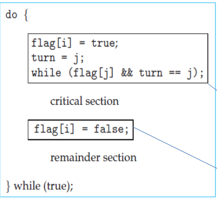


> ❓ **Hoca Sorabilir:** "Peterson algoritması neden modern mimarilerde düzgün çalışmaz?"
> ✅ **Cevap:** Modern işlemciler, performansı artırmak için komutları yeniden sıralayabilir (out-of-order execution) ve bu da `flag` ve `turn` değişkenlerinin beklenmedik şekilde güncellenmesine neden olabilir. Bu nedenle, Peterson algoritması **doğru çalışmayabilir** ve bu yüzden gerçek dünyada kullanılmaz.  

## 3. Donanımsal Senkronizasyon Çözümleri
Çözümler genellikle donanım destekli "bölünemez" (Atomic) talimatlarla (komutlarla) yapılır.
*   **Atomic Instruction (Atomik Komut):** Çalışırken yarıda kesilemeyen (interrupt edilemeyen), başlandığında mutlaka bitirilen tek parça komuttur. 
*   **Örnekler:** `TestAndSet()` ve `CompareAndSwap()` komutları. Donanım seviyesinde bu komutlar kilit (lock) görevi görerek aynı anda iki prosesin kritik bölgeye girmesini engeller.

---

## 4. Mutex Kilitleri (Mutex Locks) - Yazılımsal Çözüm
"Kritik bölgeyi korumak ve yarış durumunu önlemek için kullanılan en basit yazılımsal araçtır."
*   **Mutex** = **Mut**ual **Ex**clusion (Karşılıklı Dışlama) kelimelerinin birleşimidir.
*   Kritik bölgeye girmeden önce kilit alınır (`acquire()`), bölge bitince kilit serbest bırakılır (`release()`).

### Spinlock (Meşgul Bekleme / Busy Waiting)
Bir proses kilitli bir Mutex'i almak istediğinde, kilit açılana kadar sürekli olarak "Açıldı mı? Açıldı mı?" diye döngüde beklemesidir. 
> ❓ **Hoca Sorabilir (Eksisi / Artısı):** Spinlock'un dezavantajı nedir?
> ✅ **Cevap:** Sürekli çalışarak **CPU zamanını israf etmesi (Busy Waiting)** dir. Ancak avantajı şudur: Bekleme süresi çok kısaysa (Kritik bölge çok hızlı çalışıp bitiyorsa), **Context Switch (bağlam değişimi)** yapmaya gerek kalmadığı için çok hızlıdır. Çok çekirdekli (multicore) sistemlerde sık kullanılır.

---

## 5. Semaforlar (Semaphores) - 🚨 Klasik Sınav Sorusu
Mutex'ten daha gelişmiş, tamsayı (integer) değer alan bir senkronizasyon aracıdır. Başlangıçta Hollandalı bilim insanı Dijkstra tarafından bulunmuştur. `wait()` ve `signal()` komutları (veya P ve V) ile çalışır.

1.  **Binary Semaphore (İkili Semafor):** Sadece 0 ve 1 değerini alır. **Hoca Detayı:** Mutex lock'a tamamen benzer (eşdeğerdir). 
2.  **Counting Semaphore (Sayan Semafor):** Sınırlandırılmamış bir tamsayı alır. **Hoca Detayı:** Belirli sayıda kaynağın (örneğin 5 yazıcının) kullanımını kontrol etmek için kullanılır.

> 🚨 **Hatırlatma:** `wait()` (bekle/azalt) işlemi semafor değerini eksiltir. 0 ise prosesi uyutur (bekleme kuyruğuna atar). `signal()` (sinyal/arttır) işlemi semafor değerini arttırır ve uyuyan bir proses varsa onu uyandırır. Bu bekleme Spinlock yapmaz, CPU israfını (Busy Wait) önler!

---

## 6. Kritik Senkronizasyon Hataları (Deadlock ve Starvation)
Hocalar bu ikilinin farkını sormaya bayılır!

### Deadlock (Kilitlenme / Ölümcül Kilitlenme)
İki veya daha fazla prosesin, birbirlerinin elindeki kilitli kaynağı beklemesi ve **hiçbirinin sonsuza dek ilerleyememesi** durumudur. 
*   **Benzetme:** Dar bir köprüde karşılaşan iki inatçı keçinin "önce sen geri çık" diye birbirini saatlerce beklemesi.

### Starvation (Açlık / Süresiz Bloklama)
Bir prosesin bekleme kuyruğundan **bir türlü sırasının gelmemesi (kaynağa erişememesi)** durumudur.
*   **Benzetme:** LIFO (son giren ilk çıkar) bir kuyrukta, sürekli yeni işlerin gelmesi sebebiyle ilk gelen adamın işlemlerinin "sürekli ertelenmesi" (ama teorikte bir gün çıkabilir). 
*   **Farkı:** Deadlock'ta herkes kilitlenir, sistem durur. Starvation'da sistem akmaya devam eder ama sadece bir/birkaç gariban proses asla kaynak bulamaz.

---

## 7. Klasik Senkronizasyon Problemleri (Banko Gelen Vakalar)

### A) Bounded-Buffer Problemi (Üretici-Tüketici / Producer-Consumer)
*   **Sorun:** Sınırlı bir depo (Buffer) var. Üretici depo doluyken yeni ürün koymamalı, Tüketici de depo boşken ürün alamamalıdır. Semaforlar ile depo boş/dolu durumları eşzamanlı korunur.

### B) Readers-Writers Problemi (Okuyucular - Yazarlar)
*   Veritabanı sorularıdır. (Örn: Havayolu rezervasyonu veritabanı).
*   **Sorun:** Birden fazla Okuyucu aynı anda veriyi okuyabilir (Çünkü veri bozulmaz). AMA bir Yazar geldiğinde **sadece tek başına** olmalı ve yazma bitene kadar ne başka yazar ne de okuyucu sisteme girmemelidir. (Starvation çok yaşanır, genelde yazarlar aç kalır).

### C) Dining Philosophers Problemi (Filozofların Yemeği)
*   Hocaların favori senaryosudur. Yuvarlak masada 5 filozof var (Prosesler), aralarında 5 çubuk (Kaynak/Semafor).
*   **Sorun/Kural:** Bir filozof yemek yemek için hem solundaki hem sağındaki çubuğu almak ZORUNDADIR. 
*   **Kaza Senaryosu:** Herkes aynı anda solundaki çubuğu alırsa sağ çubuk için herkes kilitlenir = **İşte bu tam bir DEADLOCK (Kilitlenme) durumudur!**

---

## 8. Monitörler (Monitors)
Semaforları programcıların **yanlış kullanmasına** (Örn: `wait()` ve `signal()` sırasını karıştırması) çok sık rastlanır. Bunu çözmek için geliştirilen **üst düzey programlama dili yapısıdır (high-level abstraction).** Java, C# gibi dillerde dahili olarak bulunur (Örn: Java'da `synchronized` kelimesi). Sadece tek bir prosesin monitör içinde aktif olmasını programcı yerine dil kendisi garanti eder.

---

## 🎯 9. KISA SİYAH BİLGİ KARTLARI (HIZLI TEKRAR İÇİN)

*   **Peterson Çözümü:** İki prosesin kritik bölge sorununu çözmek için `turn` ve `flag[]` değişkenleri kullanan **yazılımsal** klasik bir algoritmadır. Günümüz modern mimarileri düzensiz çalıştığı için artık tam işe yaramaz.
*   **Priority Inversion (Öncelik Tersine Çevrilmesi):** Düşük öncelikli bir prosesin, yüksek öncelikli bir prosesin ihtiyaç duyduğu kaynağı (kilitleri) işgal etmesiyle oluşan, öncelik sırasını altüst eden bir hatadır. **Çözümü:** Priority-inheritance (Öncelik devri) protokolüdür (Düşük proses yüksek prosesin önceliğini geçici olarak ödünç alır).

---

## 📝 10. SINAV PROVASI: BOŞLUK DOLDURMA VE KLASİK SORULAR

1.  Ortak bir veriye aynı anda erişilip sadece "proseslerin bitiş sırasına göre" verinin son değerinin belirlenmesine (yanlış yazılmasına) **[ Race Condition (Yarış Durumu) ]** denir.
2.  Hiçbir prosesin sonsuza kadar dışlanmaması, illa ki belirli bir süre sonunda işlemine izin verilmesi şartına **[ Bounded Waiting (Sınırlı Bekleme) ]** denir.
3.  Programcının işini kolaylaştıran, `wait` ve `signal` gibi komut karmaşasını dillerin yapısı içine (Örn: Java synchronized) yediren soyut yapıya **[ Monitor ]** denir.
4.  Semaforlardan farklı olarak, sadece 0 ve 1 değeri alabilen ve kritik bölgeyi kilitlemede kullanılan basit yapıya **[ Mutex Lock / Binary Semaphore ]** denir.
5.  Eğer kilit mekanizması kullanırken bekleme işlemi prosesi tam olarak uyutmayıp CPU'da "Sürekli meşgul döngüye" sokuyorsa buna **[ Spinlock (veya Busy Waiting / Meşgul Bekleme) ]** denir.
6.  Masada 5 kişinin oturduğu, kilitlenme (deadlock) konseptini en iyi açıklayan senkronizasyon tasarım problemine **[ Dining-Philosophers (Filozofların Yemeği) ]** adı verilir.

### ❓ KLASİK SORU POTANSİYELİ:
**Soru:** *Kritik bölge problemine sunulacak bir algoritmanın/çözümün sağlaması gereken üç temel şartı yazınız ve Yalnızca "Mutual Exclusion (Karşılıklı Dışlama)" şartını kısaca açıklayınız.*

**Cevap:** Çözüm; 
1) Mutual Exclusion (Karşılıklı Dışlama)
2) Progress (İlerleme)
3) Bounded Waiting (Sınırlı Bekleme) 
olmak zorundadır. **Karşılıklı dışlama (Mutual Exclusion) prensibi:** Bir an için sadece ve sadece TEK BİR prosesin o kritik koda (kod bölgesine) girmesine izin verilmesidir. Bir proses içerideyken diğerleri mutlaka dışarıda beklemelidir. Hiçbir istisnası veya eşzamanlı erişimi yoktur.

# Donanımsal Senkronizasyon Çözümleri (Hardware Synchronization) - Sınav Hazırlık Özeti

Bu bölüm, yazılımsal çözümlerin yetersiz kaldığı veya performans sorunu yarattığı yerlerde, **doğrudan işlemci (CPU) ve bellek mimarisi seviyesinde** sunulan donanımsal çözümleri inceler. 

Hocalar bu bölümden özellikle **"Hangi çözüm hangi sistemde işe yarar/yaramaz?"** tarzı karşılaştırma soruları ile **Bounded-Waiting TestAndSet** kodunu sormayı çok severler.

---

## 1. Kesmeleri Kapatmak (Interrupt Disable) - "Balyoz Yöntemi"
Bir proses Kritik Bölge'de (CS) çalışırken, işlemcinin dışarıdan gelen (saat kesmesi vb.) tüm uyarıları (interrupts) dinlemeyi reddetmesidir. İşlemci adeta "kapıyı kilitler".

*   **Nasıl Çalışır?** İşlemci, kesmeleri kapattığında hiçbir şekilde onu yarıda kesip (preempt edip) bağlam değişimi (context switch) yapamaz. Bu yapı **Non-preemptive** (araya girilemez) mantığı benimser.

### 🚨 Sınav Sorusunun Geleceği Yer: Single-Processor vs Multi-Processor

| Sistem Türü | Kesmeleri Kapatma (Interrupt Disable) İşe Yarar mı? Neden? |
| :--- | :--- |
| **Tek İşlemcili (Single Processor)** | ✅ **Evet, harika çalışır.** Tek bir işlemci olduğu için, o işlemciyi dış dünyaya kapatmak başka hiçbir kodun araya girmemesini (Mutual Exclusion) kesin olarak sağlar. |
| **Çok İşlemcili (Multi-processor)** | ❌ **Uygun Değildir.** Kesmeleri kapat emrini diğer TÜM işlemcilere / çekirdeklere mesaj olarak göndermek inanılmaz **vakit alır (gecikme yaratır)**. Her CS girişinde bu yapıldığı için sistem verimliliği ve hızı (efficiency) yerle bir olur. |

---

## 2. Bellek Modelleri ve Bariyerleri (Memory Barriers)
Farklı işlemciler, performansı artırmak adına arka planda komutların sırasını (instruction reordering) değiştirebilir. Bu, özellikle ortak bellek kullanan thread'ler arasında ölümcül hatalar doğurur.

### A) Bellek Modelleri (Memory Models)
1.  **Strongly Ordered (Güçlü Sıralı):** Bir işlemcinin bellekte yaptığı değişiklik, diğer tüm işlemciler tarafından **ANINDA (hemen)** görülür.
2.  **Weakly Ordered (Zayıf Sıralı):** Bir işlemcinin bellek değişikliği, diğerleri tarafından **hemen görülmeyebilir**. 

### B) Memory Barrier (Bellek Bariyeri) Nedir?
Bellekteki bir değişikliğin **diğer tüm işlemcilere yayılmasını ve görünür kılınmasını ZORLAYAN** özel donanımlara has komuttur.

> 💡 **Kod Örneğinin Mantığı (Hoca Ne Demek İstiyor?):**
> Görseldeki `x = 100` ve `flag = true` örneğinde, zayıf sıralı (weakly ordered) bir işlemci hız kazanmak için `flag = true` işlemini hafızaya daha önce yazabilir. Eğer Thread 1, `flag`'in true olduğunu görüp döngüden çıkar ve `x`'i ekrana basarsa (ama `x` henüz `100` güncellenmediyse) HATA ÇIKAR. 
> Bu yüzden araya `memory_barrier();` konur. Bu komut der ki: *"Önce üstteki `x=100`'ü belleğe kesin olarak yaz, o load/store bitmeden ASLA alt satıra (`flag=true`) geçme!"*
> 
> **Not:** Memory Barrier çok düşük seviyeli bir donanım kodudur, genelde sıradan programcılar değil, **İşletim Sistemi (Kernel) geliştiricileri** Mutual Exclusion sağlamak için kullanır.

---

## 3. Atomik Özel Donanım Komutları (Hardware Instructions)
İşletim sistemleri, Kritik Bölge problemini aşmak için yürütülmesi sırasında **ASLA kesintiye (interrupt'a) uğramayan, "Atomik" (bölünemez)** özel donanım komutları sunar. Multiprocessor bir sistemde iki çekirdek aynı anda bu komutu çağırsalar dahi, donanım onları araya sadece biri girecek şekilde tek tek alır.

**İki Soyut Donanım Komutu:**
1.  `test_and_set()` : İçeriği (genelde byte/word) okur ve hemen ardından değerini true (kilitleme) yapar.
2.  `compare_and_swap()` (CAS) : İki veriyi atomik şekilde karşılaştırır, eşitse yerlerini değiştirir.

> ❓ **Hoca Testte Sorabilir (Tuzak Soru):** `TestAndSet` ve `CompareAndSwap` donanımsal özellikleri sayesinde tek başlarına CS'nin 3 altın kuralını da sağlar mı?
> ✅ **Cevap:** HAYIR! **Mutual Exclusion (Karşılıklı Dışlama)**'yı ve ilerlemeyi çok iyi sağlarlar. Ancak saf (sade) halleriyle kullanıldıklarında **Bounded-Waiting (Sınırlı Bekleme)** şartını sağlayamazlar, Starvation (Açlık) doğurabilirler.

---

## 4. 🚨 GÖRSELDEKİ KODUN DEŞİFRESİ: "Bounded-Waiting with TestAndSet"
*(İşte hocanın slaytta "Bu karmaşık kod nə yapar???" diye vuracağı kısım tam olarak burası!)*

Eklediğiniz görselde karmaşık gibi duran, tablolu bir **"Bounded wait solution with TestAndSet"** kodu var. Hoca "Mutex exclusion sağlıyor mu??" diye not düşmüş.

### Soru 1: Bu kod NEDEN bu kadar uzadı? Sade TestAndSet yetmiyor muydu?
Yukarıda dediğimiz gibi: Sade bir `TestAndSet` kodu, iki prosesten sadece birisinin içeri girmesine izin verir **(Mutual Exclusion SAĞLAR)**. İlerlemeyi de sağlar. 
❌ **ANCAK, Bounded-Waiting (Sınırlı Bekleme) ŞARTINI SAĞLAYAMAZ!** Kapıda bekleyen P0, P1, P2, P3 varken, P0 çıkıp CS'yi açtığında kimin daha hızlı davranıp içeri gireceği tamamen donanım hızında rastgeledir. Şanssız bir proses "Açlık (Starvation)" yaşayabilir, sonsuza dek içeri giremeyebilir.

✅ **Çözüm (Görseldeki Kod):** Starvation'u önlemek ve "Sınırlı Bekleme" kuralını sağlamak için koda `waiting[n]` (bekleyenler) isimli bir dizi (array) eklenmiştir.

### Soru 2: Entry Section (Giriş) Adım Adım Ne Yapıyor?
Görseldeki `while` döngüsü olan kısım:
```c
waiting[i] = true;             // Adım 1: "Ben (Pi) kapıya geldim, içeri girmek için kuyruktayım" (Bayrak Kaldır).
key = true;                    // Adım 2: Elimize sanal bir kilit anahtarı (key) alıyoruz.
while (waiting[i] && key)      // Adım 3: Pi hem "bekliyor" pozisyonundaysa hem de "anahtar henüz bende" değilse dönmeye (spin) devam et.
    key = TestAndSet(&lock);   // Adım 4: KİLİDİ ZORLA. Eğer açık (lock=false) ise TestAndSet onu (true) kilitler ve kendisi false döner! false dönerse while kırılır!
waiting[i] = false;            // Adım 5: Artık kilidi kırdım içeriye giriyorum. "Bekliyorum" bayrağımı false (F) yaparak CS'ye daldım.

// ---> BURASI KRİTİK BÖLGE (CS) <--- 
```
*Görseldeki tablonun açıklaması:*
P0, P1, P2 gibi prosesler var. Tabloda P0 kapıya gelip `waiting[0]=T` yapmış, `key=T` ayarlamış ve TestAndSet kapısını dövmektedir. Başardığında `waiting[0]` tablosu `F` olacak.

### Soru 3: Exit Section Algoritması Nasıl Adalet Sağlıyor? (Çıkış Kısmı)
Bencilce çıkıp `lock = false` yapıp kaçılmaz. Bir j prosesi çıkarılır (i+1 mod n şeklinde). Eğer kapıda `waiting[j] == true` olan biri varsa, direk onun `waiting[j]` değerini false yapar! Bu sayede onu döngüden manuel olarak kurtarıp kilidi bizzat ona hediye etmiş olur. İşte **Sınırlı Bekleme (Bounded Waiting)** garanti altına alınmış olur!

> 🔥 **En Net Cevap ("Mutex exclusion sağlıyor mu??" notuna):** 
> Evet kesinlikle sağlıyor. Çünkü `TestAndSet(&lock)` fonksiyonu donanım tabanlı Atomik (Bölünemez) bir fonksiyondur. İki proses P0 ve P1 döngü içerisinde aynı milisaniyede `lock`'a saldırsalar bile, işlemci donanımı yalnızca P0'a `false` döner ve hemen kapıyı kapatır. P1 `true` okuyarak kapıda beklemeye devam eder. O yüzden **Mutual Exclusion Kesinlikle Sağlanır**.

---


# Son Tekrar: Semaforlar (Semaphores) ve Monitörler (Monitors)

Süreç Senkronizasyonu konusunda öğrencilerin en çok karıştırdığı ve hocaların sınavda buradan eleme yapmayı en çok sevdiği iki kavramdır. Bu dokümanda aralarındaki farksal uçurumu kod örnekleriyle kapatıp, hocaların klasik "Tuzak Sorularını" deşifre edeceğiz.

---

## 1. Semafor (Semaphore) Nedir? 
Hollandalı bilim insanı Dijkstra tarafından icat edilmiştir. Özünde, **yalnızca iki atomik komutla (`wait` ve `signal` veya P ve V)** erişilebilen ve değeri değiştirilebilen bir **Tamsayı (Integer) değişkenidir (`S`)**. 

*   **`wait(S)` (Bekle / Azalt):** Semaforun değerini 1 azaltır. Eğer değer 0 (veya negatif) ise prosesi uyutur ve bekleme kuyruğuna atar.
*   **`signal(S)` (Sinyal / Arttır):** Semaforun değerini 1 arttırır. Eğer kuyrukta uyuyan proses varsa **birini uyandırır** ve çalıştırır.

### Semaforun Kanayan Yarası (Neden Sorunludur?)
Semafor işletim sistemi veya kütüphane düzeyindedir. Tüm kontrol ve sorumluluk **tamamen programcının (insanın) omuzlarındadır.**

> 🚨 **Klasik Sınav Sorusu: "Semaforlarda Programcı Hatası"**
> Hoca kod verir ve "Bu kodda ne hata var?" diye sorar.
> 
> ```c
> // DOĞRU KULLANIM:
> wait(mutex); 
>   /* Kritik Bölge (CS) */
> signal(mutex); 
> ```
> 
> **Hata 1 (Sırayı Karıştırmak):**
> ```c
> signal(mutex); // YANLIŞ! Kilit açma ile başlandı
>   /* CS */
> wait(mutex);
> ```
> *Sonuç:* Karşılıklı Dışlama (Mutual Exclusion) bozulur. Herkes içeri girer, Race Condition oluşur.
> 
> **Hata 2 (Signal'i Unutmak / İki kere Wait yazmak):**
> ```c
> wait(mutex);
>   /* CS */
> wait(mutex); // YANLIŞ! Çıkarken de kilitledi
> ```
> *Sonuç:* Çıkışta kilit açılmadığı için kapıda bekleyen diğer prosesler sonsuza kadar bekler = **DEADLOCK (Ölümcül Kilitlenme)!**

---

## 2. Monitör (Monitor) Nedir?
Semaforlardaki "insan hatası" riskini (yanlış yere wait/signal yazıp sistemi çökertmeyi) ortadan kaldırmak için geliştirilmiş **Üst Düzey Programlama Dili (High-level Language) Yapısıdır.**

*   Monitör, içerisinde kendi lokal değişkenlerini, fonksiyonlarını ve başlatma (init) kodlarını barındıran bir "Kutu" (Sınıf/Nesne) gibidir.
*   **Hayati Özelliği:** Monitörün içine aynı anda **SADECE BİR PROSES (Thread)** girebilir ve içerideki kodları çalıştırabilir. Bunu senin yerine **DERLEYİCİ (Dilin kendisi)** garanti eder!

### Kod Örneği (Java - Monitör Kullanımı):
Java dilindeki `synchronized` anahtar kelimesi aslında bir monitördür. İşletim sistemi karmaşasıyla uğraşmazsın.

```java
public class BankaHesabi {
    private int bakiye = 100;

    // "synchronized" kelimesi burayı bir Monitör yapar.
    // İşletim sistemi, buraya aynı anda iki thread'in girmesini YASAKLAR.
    public synchronized void paraCek(int miktar) {
        if (bakiye >= miktar) {
            bakiye = bakiye - miktar;
        }
    }
}
```

### Monitör İçinde Senkronizasyon (Condition Variables)
Sadece Mutual Exclusion (tek kişi girsin) yetmez, bazen giren kişinin sırası gelmemiştir ve beklemesi gerekir. Monitörler bunu **Condition (Koşul) Değişkenleri** ile çözer. Buralarda da `x.wait()` ve `x.signal()` kullanılır ama bu semaforlarınkinden farklıdır!

*   `x.wait()`: Prosesi uyutur ve **monitörü hemen başka birine devreder** (kilit açılır).
*   `x.signal()`: Uyuyan SADECE BİR prosesi anında uyandırıp sırayı ona verir.

---

## 3. SEMAFOR VE MONİTÖR KARŞILAŞTIRMASI (HOCANIN FAVORİ TABLOSU)

| Özellik | Semafor (Semaphore) | Monitör (Monitor) |
| :--- | :--- | :--- |
| **Seviye / Yapı** | İşletim Sistemi / Kütüphane düzeyindedir. Basit bir tamsayıdır (Integer). | Derleyici / Programlama dili düzeyindedir (Java, C#). Gelişmiş bir Soyut Yapıdır (ADT). |
| **Sorumluluk** | **Programcıya aittir.** Wait/Signal sırasını programcı yönetir. | **Derleyiciye (Sisteme) aittir.** Kilit mekanizmasını dil kendi otomatik yönetir. |
| **Hata İhtimali** | Çok yüksektir. Kolayca Deadlock'a veya Race Condition'a sebep olunabilir. | Çok düşüktür. İnsan faktörü hatası minimize edilmiştir. |
| **Mutual Exclusion** | Wait ve Signal ile manuel sağlanmak zorundadır. | Monitör yapısı gereği **Otomatik (varsayılan olarak)** sağlanır. |

---

# Bölüm 8: CPU Scheduling (İşlemci Çizelgeleme) - Sınav Çalışma Notları

Bu doküman, CPU Scheduling (İşlemci Çizelgeleme) konusunun önemli yerlerini, sınavda çıkabilecek teorik soruları ve algoritmaların hesaplama yönergelerini içermektedir.

---

## 📌 Temel Kavramlar

### Multiprogramming ve Multitasking
- **Multiprogramming:** İşletim sisteminde birden fazla programın aynı anda bellekte tutularak, CPU'nun her zaman yürütecek bir process bulması durumudur. Bir process I/O (girdi/çıktı) için beklemeye geçerse, CPU boşta durmaz; sıradaki diğer process'e geçer. **Amaç:** CPU verimliliğini artırmaktır.
- **Multitasking (Zaman Paylaşımlı):** Multiprogramming'in genişletilmiş halidir. CPU, process'ler arasında o kadar hızlı geçiş yapar ki, kullanıcılar tüm process'lerin aynı anda çalıştığı hissine kapılır. **Amaç:** Sistemin kullanıcıya olan yanıt verebilirliğini (response time) artırmaktır.

### CPU Burst ve I/O Burst Döngüsü
Process'ler çalışma ömürleri boyunca genellikle iki temel döngü arasında gidip gelirler:
1. **CPU Burst:** İşlemcinin aktif olarak hesaplama yaptığı zaman dilimi.
2. **I/O Burst:** Process'in girdi-çıktı işlemleri için (örneğin bellekten bir şey okuması) beklediği zaman dilimi.
*Not: CPU burst grafikleri genellikle çok sayıda az süreli (kısa) burst ve az sayıda uzun süreli burst şeklinde eksponansiyel bir karakter gösterir.*

---

## 📌 CPU Scheduler (İşlemci Çizelgeyici) ve Dispatcher

### Short-Term Scheduler (CPU Scheduler)
CPU boşta kaldığı anda, hazır konumda (**Ready Queue**) bekleyen process'lerden birini seçip CPU'ya atayan modüldür. *Sınavda sorulabilir: Hangi sıraya göre seçer? İlla FIFO olmak zorunda değildir; öncelik (priority), ağaç yapısı vb. şeklinde olabilir.*

### Dispatcher Modülü
Short-term scheduler'ın seçtiği process'i **fiziksel olarak CPU'ya geçiren** bileşendir. Şu işlevleri yerine getirir:
1. Context Switching (Bağlam değişimi)
2. Kernel modundan Kullanıcı (User) moduna geçiş.
3. Programı kaldığı yerden devam ettirmek.

🔥 **Banko Soru Adayı: Dispatch Latency Nedir?**
**Cevap:** Dispatcher'ın bir process'i durdurup, yerine diğer process'i başlatmasına kadar geçen **gecikme süresine** dispatch latency denir.

---

## 📌 Preemptive vs. Nonpreemptive Scheduling

İşletim sisteminin Scheduling kararı verdiği 4 ana durum vardır:
1. Process **Running** $\rightarrow$ **Waiting** (I/O isteği vb.)
2. Process **Running** $\rightarrow$ **Ready** (Zaman diliminin bitmesi, kesme-interrupt gelmesi)
3. Process **Waiting** $\rightarrow$ **Ready** (I/O bitti)
4. Process **Sonlandırılırsa (Terminated)**

**Nonpreemptive (Kesintiye Uğratılamaz - Kooperatif):**
Sadece 1 ve 4 numaralı durumlarda gerçekleşirse buna *nonpreemptive* denir. İşlemci bir process'e verildiğinde, o process ya kendi isteğiyle beklemeye geçer ya da tamamen bitene kadar işlemciyi **asla bırakmaz.**

**Preemptive (Kesintiye Uğratılabilir):**
2 ve 3 numaralı durumlarda da karar veriliyorsa *preemptive*'dir. Yüksek öncelikli bir process geldiğinde veya zaman bittiğinde işletim sistemi mevcut process'i zorla CPU'dan atar (askıya alır). Çoğu modern OS (Windows, Linux, macOS) bunu kullanır. *Dikkat: Preemptive sistemlerde process'ler arasında paylaşılan verilerde "Race Condition" oluşabilir.*

---

## 📌 Scheduling (Çizelgeleme) Kriterleri
Sınavda eşleştirme veya "hangisinin artırılması/azaltılması hedeflenir?" tarzı sorulur.

* **Artırılması (Maksimize) İstenenler:**
  - **CPU Utilization (CPU Kullanım Oranı):** İşlemcinin meşgul tutulma oranıdır (%40-%90 arası idealdir).
  - **Throughput (İş Hacmi):** Belirli bir zaman diliminde yürütülmesi **tamamlanan** process sayısıdır.

* **Azaltılması (Minimize) İstenenler:**
  - **Turnaround Time (Dönüş Süresi):** Sürecin sisteme girdiği an ile tamamen bitip sonlandığı an arasındaki **toplam** süredir. *(Hazır kuyrukta bekleme + CPU'da çalışma + I/O işlem sürelerinin toplamı).*
  - **Waiting Time (Bekleme Süresi):** Sadece **Ready Queue'da** (hazır kuyruğunda) geçen toplam bekleme süresidir.
  - **Response Time (Yanıt Süresi):** Sisteme istekte bulunulduğu andan itibaren, **ilk tepkinin/yanıtın gelmeye başladığı** ana kadar geçen süredir. Uygulamanın açılma hızı gibi düşünülebilir.

---

## 📌 Algoritmalar

### 1- First-Come, First-Served (FCFS)
* **Mantığı:** Gelen ilk alır. CPU'yu ilk isteyen ilk geçer (FIFO mantığı).
* **Türü:** Kesinlikle **Nonpreemptive**'dir.
* **Dezavantaj:** Bekleme süreleri ortalaması çok yüksek olabilir. Process'lerin geliş sırasına göre çok değişir.

🔥 **Banko Terim Sorusu: Convoy Effect (Konvoy Etkisi) Nedir?**
**Cevap:** FCFS algoritmasında yaşanan bir sıkıntıdır. CPU'yu çok uzun süre kullanacak olan bir process (CPU-bound) başa geçtiğinde, onun arkasında bekleyen çok sayıda kısa süreli (I/O-bound) process'in tıkanıp kalması ve işlemcinin verimsiz kullanılması durumudur. Kamyon arkasındaki otomobil konvoyu gibi düşünün.

### 2- Shortest-Job-First (SJF)
* **Mantığı:** Bir sonraki CPU burst (çalışma) süresi **en kısa** olan process'i önce çalıştırır.
* **Avantajı:** Belirli bir process seti için **minimum ortalama bekleme süresini (waiting time)** sağlayan optimal algoritmadır.
* **Dezavantajı:** Bir process'in bir sonraki kısa çalışma süresini önceden bilmek imkansıza yakındır. (Geçmiş sürelere dayanarak matematiksel eksponansiyel ortalama *Exponential Average* formülü ile tahmin edilmeye çalışılır: $t_n$ ve $\tau_{n+1}$ parametreleri ile).

**İki Tipi Vardır:**
1. **Nonpreemptive SJF:** CPU process'e verildikten sonra, CPU burst bitene kadar process kesilmez.
2. **Preemptive SJF (Shortest-Remaining-Time-First - SRTF):** Process hazır kuyruğuna girdiğinde; yeni gelen process'in CPU ihtiyacı, şu an çalışmakta olan process'in **kalan işlem süresinden (remaining time)** daha kısaysa, mevcut olan zorla durdurulur ve yeni gelen çalıştırılır. Yukarıdaki sınav sorularınızda tam olarak bu çözüldü!

---

## 🎯 Sınav Simülasyonu - Doğru/Yanlış ve Boşluk Doldurma

**1.** CPU üzerindeki bir process'i fiziksel olarak devredip yetkiyi başka bir process'e aktaran, arada "Context Switch" yapan modülün özel ismi .................................................'dır.
*(Cevap: Dispatcher)*

**2.** Çoğu işletim sistemi non-preemptive zamanlama yaklaşımını benimser. (Doğru / Yanlış)
*(Cevap: Yanlış. Neredeyse tüm modern işletim sistemleri Windows, Linux vb. Preemptive kullanır.)*

**3.** ............................................ zamanlama algoritmasının en temel sorunu Convoy effect yaşatmasıdır.
*(Cevap: FCFS - First Come First Served)*

**4.** Sistemi hızlandırmak için Throughput artırılırken Turnaround time azaltılmaya çalışılır. (Doğru / Yanlış)
*(Cevap: Doğru)*

**5.** Hem gelen süreçlerin bitmesini beklemeyen hem de kalan süreye bakarak eski süreci askıya alan algoritmaya Shortest-Job-First (SJF) denmesinin Preemptive versiyonuna ............................................................. denir.
*(Cevap: Shortest-Remaining-Time-First (SRTF))*

**6.** SJF algoritmasının short-term scheduling için uygulanmasındaki en büyük zorluk ne olabilir? Hesaplayarak bulun?
*(Cevap: İşletim sistemi, process'in bir sonraki adımda işlemcide ne kadar süre vakit geçireceğini bilemez. Geleceği tahmin etmek zordur.)*


## 🎯 4. HOCALARIN SORMAKTAN KEYİF ALDIĞI SINAV SORULARI

**Soru 1: Semaforlar varken neden Monitörler icat edilmiştir / ihtiyaç duyulmuştur?**
**Cevap:** Semaforlarda Mutual Exclusion (Karşılıklı dışlama) sağlamak tamamen programcının `wait()` ve `signal()` komutlarını doğru ve hatasız yere yazmasına bağlıdır. Programcı yanlışlıkla sırayı karıştırırsa, bir `signal()` komutunu unutursa veya fazladan `wait()` yazarsa **Deadlock (Ölümcül kilitlenme)** veya **Yarış Durumu (Race Condition)** kaçınılmazdır. Monitörler, bu sorumluluğu programcıdan alıp **derleyiciye/dile** devrederek programcı kaynaklı hataları ve kilitlenmeleri önlemek, daha yüksek seviyeli/güvenli bir kodlama sunmak için icat edilmiştir.

**Soru 2: İkili Semafor (Binary Semaphore) ile Mutex Lock arasındaki fark nedir?**
*(Hocaların çok sevdiği tuzak sorulardan biridir, çünkü %90 aynıdır denip geçilir ama ince bir farkı vardır.)*
**Cevap:** İkisi de 0 ve 1 değeri alır ve Kritik bölgeyi korur. Ancak en büyük fark **Sahiplik (Ownership)** durumudur.
*   **Mutex'te** kilidi hangi proses aldıysa (kapattıysa), işi bitince kilidi *MECBUREN KENDİSİ* açmak zorundadır. Başkası gelip açamaz.
*   **İkili Semafor'da** böyle bir sahiplik kuralı yoktur. Bir proses `wait()` yapıp kilitlese bile, dışarıdan bambaşka bir proses gelip `signal()` göndererek o kilidi rastgele açabilir!

**Soru 3: Monitör içerisindeki bir `x.signal()` komutu ile Semaforlardaki `signal(S)` komutunun farkı nedir?**
**Cevap:** 
*   **Semaforda** kuyrukta uyuyan kimse yoksa (boşsa), `signal()` işlemi semafor değerini +1 arttırır ve bu değer orada kalır (kaybolmaz, geleceğe yatırımdır).
*   **Monitörde** (Condition Variable'da) ise uyuyan kimse yokken `x.signal()` çağrılırsa bu sinyal boşluğa gider **(tamamen kaybolur/yok sayılır)**. Değişkenin değerini kalıcı olarak etkilemez.

**Soru 4: (Senaryo) 5 kişilik bir havuz verisi var. İşletim sistemi bu 5 kaynağı dinamik olarak yönetmek istiyor. Burada Mutex mi kullanılır, İkili (Binary) Semafor mu, Sayan (Counting) Semafor mu?**
**Cevap:** **Counting (Sayan) Semafor** kullanılır. Çünkü Mutex ve Binary semafor SADECE 0 ve 1 değerini alır (tek bir kaynağı korur). 5 kaynak varsa Sayan Semafor ilk değerini 5 yapar, her `wait()` işleminde 1 azalır, 0 olduğunda yeni gelen 6. kişiyi içeri almaz uyutur. Kaynak havuzları (Örn: 5 yazıcı bağlantısı) sayan semaforlarla yönetilir.


## 🎯 5. SINAV PROVASI: KELİME AVI VE TESPİT SORULARI

**1. Boşluk Doldurma:**
Bir değişkenin belleğe yazılması ve diğer işlemciler tarafından da görülmesinin arka planda gecikmeli olarak sağlanabildiği bellek mimarilerine **[ Weakly Ordered (Zayıf Sıralı) ]** bellek modeli denir. Yazılım ve donanım senkronizasyon kaymasını engellemek ve işlem sırasını zorunlu tutmak için **[ Memory Barrier (Bellek Bariyeri) ]** komutları kullanılır.

**2. Klasik Doğru/Yanlış Yanıltmacası:**
* *"Tek işlemcili bir sistemde (Single Processor), dış kesmeleri (interrupt) kapatmak Kritik Bölge problemini çözmek için harika ve tam garantili (Non-preemptive olduğu için) bir yoldur."* -> **DOĞRU!** Başka hiçbir komut/görev (timer dahil) araya giremeyeceği için CS güvenlidir.
* *"Mükemmel çalıştığı için, Çok çekirdekli (Multiprocessor) sistemlerde de kesmeleri kapatmak en iyi çözümdür."* -> **YANLIŞ!** Multi-process sistemlerde kesmeleri kapattırma sinyalini tüm çekirdeklere iletmek zaman alır, aşırı performans düşüşü yaratır.

**3. Görselle Alakalı / Kod Klasik Senaryo Sorusu:**
*Soru:* İşletim sistemlerinde sunulan `TestAndSet` veya `CompareAndSwap` donanım talimatlarının tek başlarına kullanıldığında yetersiz kaldığı/çözemeyebileceği Kritik Bölge şartı hangisidir? Yukarıdaki görselde bu eksiği kapatmak için nasıl bir yaklaşım sergilenmiştir?
*Cevap:* Atomik donanım talimatları tek başlarına **Bounded Waiting (Sınırlı Bekleme)** kuralını garanti edemez ve **Starvation (Açlığa)** yol açıp bir prosesin sonsuza dek kuyrukta beklemesine neden olabilirler. Görseldeki çözümde bu boşluğu kapatmak için, koda kapıda bekleyenleri adaletli sıraya koyan `waiting[i]` boolean dizisi eklenmesi yaklaşımı sergilenmiştir. Bu sayede çıkış yapan proses, bencilce kilidi fırlatıp atmak yerine kendinden sonra sırası gelen ilk bekleyen prosese kilidi bizzat teslim eder.Donanım Seviyesinde (Hardware) en kaba ama en etkili çözüme geldik. Bu yöntem, özellikle tek işlemcili (single-processor) sistemlerde "balyoz" etkisi yaratır.


# İşletim Sistemleri - Sınav Öncesi Çalışma Soruları (Deneme Sınavı)

Hocanızın soru tarzına (çoktan seçmeli, boşluk doldurma ve klasik sorulara dengeli ağırlık veren) ve bugüne kadar çalıştığımız tüm notlara (Giriş, Prosesler, Threadler, Senkronizasyon, Donanım Çözümleri ve Deadlock) dayanarak kendinizi test edebileceğiniz harika bir deneme sınavı hazırladım.

---

## BÖLÜM 1: ÇOKTAN SEÇMELİ SORULAR (Her soru 5 Puan)

**1.** Bir process (süreç) çalışırken dinamik olarak büyüyüp küçülebilen ve `malloc()` gibi fonksiyonlarla bellekte çalışma zamanında (run-time) tahsis edilen verilerin tutulduğu bellek bölgesi aşağıdakilerden hangisidir?
a) Text (Kod)
b) Stack (Yığın)
c) Heap (Öbek) 
d) Data 
e) Registers

**2.** İşletim sisteminin User Mode'da (Kullanıcı Modu) çalışan bir uygulamanın donanıma erişebilmesi için Kernel Mode'a (Çekirdek Moduna) geçişini sağlayan "yasal kapı" aşağıdakilerden hangisidir?
a) Interrupt (Kesme)
b) System Call (Sistem Çağrısı)
c) API
d) Bootstrap
e) Dispatcher

**3.** "Sınırlı Bekleme (Bounded Waiting)" koşulunu sağlamak amacıyla standart `TestAndSet` gibi atomik donanım talimatlarına çoğunlukla (slayttaki örnekteki gibi) hangi veri yapısı entegre edilir?
a) Boolean değişkenli bir kuyruk/dizi (`waiting[i]`)
b) Turn değişkeni
c) Mutex Kilidi
d) Bir adet Binary Semaphore
e) Sayıcı Semafor (Counting Semaphore)

**4.** Aşağıdaki multithreading eşleşme modellerinden hangisinde, programcı tarafından atanan kullanıcı iş parçacıklarının (user threads) her biri arka planda ayrı bir donanım iş parçacığına (kernel thread) kilitlenir ve birbirlerini hiç bloke etmezler?
a) Implicit Threading
b) Many-to-One (Çoktan Bire)
c) Many-to-Many (Çoktan Çoğa)
d) One-to-One (Bire Bir)
e) Thread Pool (İş parçacığı havuzu)

**5.** Deadlock (Kilitlenme) oluşması için dört şartın eşzamanlı olarak gerçekleşmesi zorunludur. Bir prosesin elindeki kaynağı yalnızca kendi işi bittiğinde veya kendi isteğiyle serbest bırakması, bu süre zarfında kaynağın **zorla alınamaması** kuralına ne ad verilir?
a) Mutual Exclusion
b) Circular Wait
c) No Preemption
d) Hold and Wait
e) Busy Waiting

**6.** Çok çekirdekli (Multi-processor) bir sistemde kritik bölgeyi (Critical Section) korumak için aşağıdaki yöntemlerden hangisini kullanmak **en büyük sistem gecikmesine ve performans kaybına** yol açar?
a) Interruptları kapatmak (Interrupt Disable)
b) Mutex Kilitleri
c) Semafor kullanımı
d) Compare and Swap mimarisi
e) Monitör (Monitor) yapısı

---

## BÖLÜM 2: BOŞLUK DOLDURMA (Her Boşluk 4 Puan)

1. Bir prosesin çalışırken beklenmedik bir hata verip sonlandırılması sonrasında, hatanın sebebini bulmak (debug) amacıyla bellek alanının kaydedilmesine **[ ___________________ ]** denir.
2. İşletim sistemlerinde iki prosesin hafızada ortak bir alan üzerinden haberleştiği, çok hızlı olan ancak mutlaka senkronizasyon gerektiren IPC (Interprocess Communication) yöntemine **[ ___________________ ]** denir.
3. Kilitli bir kritik bölgenin kapısında "tamamen uykuya dalmak yerine" sürekli döngüde kontrol ederek CPU zamanını israf eden mekanizmalara genel adıyla **[ ___________________ ]** denir.
4. Sistemlerin Deadlock'tan (Ölümcül kilitlenmeden) dinamik olarak kaçınmasını sağlayan ve her kaynak tahsisi öncesinde "Safe State (Güvenli Durum)" hesabı yapan meşhur algoritmaya **[ ___________________ ]** adı verilir.
5. Bir child (çocuk) proses işini bitirip sonlandığında, eğer parent (baba) proses henüz `wait()` çağrısı yapıp sonucunu almamışsa, işletim sistemi listesinde giriş kaplamaya devam eden bu çocuğa **[ ___________________ ]** proses denir.

---

## BÖLÜM 3: KLASİK VE UZUN CEVAPLI SORULAR

**Soru 1 (15 Puan):** Thread (İş parçacığı) kullanmanın, yeni bir tam Process (Süreç) oluşturmaya göre getirdiği 3 temel avantajı maddeler halinde yazınız.
**Cevap 1:**


**Soru 2 (15 Puan):** Kritik Bölge (Critical Section) probleminin çözülmesi için bir algoritmanın sağlaması gereken 3 mutlak şart nedir? İsimlerini yazıp sacede "Mutual Exclusion (Karşılıklı Dışlama)" şartını kısaca açıklayınız.
**Cevap 2:**


**Soru 3 (10 Puan):** "Deadlock Prevention (Önleme)" ile "Deadlock Avoidance (Kaçınma)" mekanizmaları birbirinden tamamen farklıdır. İkisinin sisteme yaklaşım şekli arasındaki felsefi farkı kısaca açıklayınız.
**Cevap 3:**


<br><br><br><br>

---

# CEVAP ANAHTARI VE AÇIKLAMALAR 
*(Cevaplarınızı üst tarafa yazdıktan sonra buradan kontrol edin)*

### Bölüm 1: Test Çözümleri
1. **c) Heap** -> Dinamik olarak çalışma zamanında büyüyen bölgedir. Stack geçici adreslerdir.
2. **b) System Call** -> Donanıma doğrudan müdahalenin güvenilir yoludur. API'ler System Call çağırır ancak asıl geçiş aracı System Call'dur.
3. **a) Boolean değişkenli bir kuyruk/dizi (`waiting[i]`)** -> TestAndSet kendi başına donanımsaldır ve Bounded Waiting sağlamaz. Hocanın slaytındaki tablolu çözümde "kuyruk" için `waiting[i]` kullanılıyordu.
4. **d) One-to-One** -> Gerçek donanım paralelitesi sunan ancak sistem limitlerine dayanan standart (Linux/Windows) modelidir.
5. **c) No Preemption** -> Zorla almaya preemption denir, zorla alınamamasına no preemption.
6. **a) Interruptları kapatmak** -> Tek çekirdekte hayat kurtarır ama çok çekirdekte diğer çekirdeklere mesaj iletmek donanımı felç eder.

### Bölüm 2: Boşluk Doldurma Çözümleri
1. **[ Core Dump ]** -> İşletim sisteminin kendi çökmesine Crash Dump denirken, proses çökmesine Core Dump denir.
2. **[ Shared Memory (Paylaşılan Bellek) ]** -> Diğer yöntem Message Passing'dir ama yavaştır.
3. **[ Spinlock (veya Busy Waiting / Meşgul Bekleme) ]** -> Sürekli dönerek CPU'yu yoran kilitlerdir.
4. **[ Banker Algoritması (Banker's Algorithm) ]** -> Dijkstra'nın ünlü kaçınma (avoidance) formülüdür.
5. **[ Zombie (Zombi) ]** -> Eğer baba ölseydi yetim (orphan) olurdu. Çocuk ölür baba alırsa zombi olur.

### Bölüm 3: Klasik Soru Çözümleri
**Test-Cevap 1:**
1. Ekonomi: Yeni bir proses oluşturmak bellek ayırmayı gerektirdiği için pahalıdır. Thread'ler anaprosese ait kaynakları paylaştığından Context Switch çok daha ucuz ve hızlıdır.
2. Kaynak Paylaşımı: Threadler IPC'ye (Message Passing vb.) ihtiyaç duymadan kod ve data alanını otomatik paylaşırlar.
3. Ölçeklenebilirlik / Cevap Verebilirlik: Çok işlemcilikli yapılardan tam fayda sağlar. Bir thread bloklansa bile diğeri akıcı şekilde arayüzü kontrol edebilir.

**Test-Cevap 2:**
Üç Şart: 1) Mutual Exclusion, 2) Progress (İlerleme), 3) Bounded Waiting (Sınırlı Bekleme).
Açıklama (Mutual Exclusion): Eğer bir proses kendi kritik bölgesinde işlem yapıyor/kodu çalıştırıyorsa, eş zamanlı olarak başka hiçbir prosesin o kritik bölgeye dahi girmesine izin verilmemesi prensibidir. Asla paylaşılamaz.

**Test-Cevap 3:**
*Prevention (Önleme)*, daha sistem kurulurken Deadlock için şart olan 4 koşuldan (Mutual exclusion, hold and wait vb.) en az birisini kati suretle imkansız hale getirecek katı kurallar ile sistemi çalıştırmaktır. Kaynak tüketimi israflıdır. 
*Avoidance (Kaçınma)* ise, kuralsızlıktır fakat ileri görüşlülüktür. Bankacı algoritması gibi dinamik hesaplar kurarak, arka planda "Ben bu sürece bu kaynağı verirsem ileride deadlock yaşanabilme ihtimali olan bir Unsafe duruma düşer miyim?" diye hesap yapmasıdır. Durum safe ise kaynak verir, değilse red eder.

# İşletim Sistemleri - Sınav Soruları ve Detaylı Çözümleri

Gönderdiğiniz görsellerde yer alan ara sınav kağıdındaki tüm klasik, boşluk doldurma ve çoktan seçmeli test sorularını okuyup detaylı cevap anahtarlarıyla beraber bir çalışma dokümanı haline getirdim.

---

## BÖLÜM 1: ÇOKTAN SEÇMELİ TEST SORULARI (Test Bölümü)

**Soru 1:** Bir process geçici olarak bellekten diske (secondary memory) yer değiştirilebilir ve daha sonra yürütmeye devam etmek için tekrar belleğe alınabilir. Buradaki ilgili ikincil hafıza birimi ve gerçekleşen işlemin doğru tanımlama çifti aşağıdakilerden hangisidir?
*   **Cevap:** **e) backing store, swapping**
*   *Açıklama:* İşletim sistemlerinde süreçlerin ana bellek (RAM) ve disk arasında yer değiştirmesine Swapping (Takaslama) denir. Bu geçici disk alanına da Backing Store adı verilir.

**Soru 2:** Dinamik depolama tahsisi probleminin çözümünde hangi bellek ayırma stratejisi, bir işlemi ona barındıracak kadar büyük olan ilk kullanılabilir bellek bloğuna yerleştirmeye çalışır?
*   **Cevap:** **d) First fit**
*   *Açıklama:* First-fit algoritması belleği baştan tarar ve sığdığı ilk (first) boşluğa (hole) yerleşim yapar.

**Soru 3:** Bir process bir kaynağı kullanmak istediğinde sırasıyla gerçekleştirdiği sistem çağrılarının sıralaması hangi seçenekte doğru verilmiştir?
*   **Cevap:** **a) Request - Use - Release**
*   *Açıklama:* Yaşam döngüsü: Önce kaynak talep edilir (Request), tahsis edilirse kullanılır (Use), iş bitince serbest bırakılır (Release).

**Soru 4:** Aşağıda verilen processler Shortest Remaining Time First (SRTF) algoritmasına göre yürütüldüğünde elde edilen ortalama waiting (bekleme) ve turnaround (geri dönüş) değerleri hangi seçenekte verilmiştir? (P1: Arrival=0, Burst=7 | P2: Arr=2, Burst=4 | P3: Arr=4, Burst=1 | P4: Arr=5, Burst=4)
*   **Cevap:** **b) 3, 7** (Ortalama Bekleme: 3, Ortalama Geri Dönüş: 7)
*   *Açıklama:*
    *   0-2 arası P1 çalışır (P1 kalan:5).
    *   2'de P2 gelir, kalan süresi (4), P1'den (5) küçük olduğu için CPU'yu alır (Preemption). 2-4 arası P2 çalışır (P2 kalan:2).
    *   4'te P3 (süre:1) gelir, P2'den (2) küçük olduğu için P3 çalışır ve 5'te biter.
    *   5'te P4 gelir (süre:4). Kalanlar: P1(5), P2(2), P4(4). En kısa P2 seçilir, 5-7 arası çalışır ve biter.
    *   7-11 arası P4 çalışır ve biter.
    *   11-16 arası P1 çalışır ve biter.
    *   *Turnaround:* P1(16-0=16), P2(7-2=5), P3(5-4=1), P4(11-5=6). Toplam=28, Ort=28/4=7.
    *   *Wait:* Turnaround - Burst = P1(16-7=9), P2(5-4=1), P3(1-1=0), P4(6-4=2). Toplam=12, Ort=12/4=3.

**Soru 5:** Hangi modül CPU'nun kontrolünü short-term scheduler (kısa vadeli zamanlayıcı) tarafından seçilen sürece verir?
*   **Cevap:** **a) Dispatcher**
*   *Açıklama:* Scheduler (zamanlayıcı) kimi çalıştıracağını seçer, **Dispatcher (Dağıtıcı)** ise o süreci CPU'ya bizzat bindiren ve context switch'i yapan modüldür.

**Soru 6:** Paylaşımsız kaynak bir process tarafından tutulurken başka bir processin bu kaynağa istek yapması durumunda ikinci processin kaynak boşalıncaya kadar beklemesi aşağıdakilerden hangisi ile açıklanır?
*   **Cevap:** **b) Tut ve bekle (Hold and wait)**

**Soru 7:** Bir process'in (işlemin) sunulduğu andan tamamlanma zamanına kadar geçen süre ____ olarak adlandırılır.
*   **Cevap:** **c) turnaround (geri dönüş) süresi**

**Soru 8:** Thread oluşturma işinin uygulama geliştiriciler yerine derleyici (compiler) tarafından yapılması aşağıdakilerden hangisi ile açıklanır?
*   **Cevap:** **d) Dolaylı thread oluşturma (Implicit threading)**

**Soru 9:** Aşağıdakilerden hangisi kernel (çekirdek) tarafından programlanamaz (schedule edilemez)?
*   **Cevap:** **e) User-level threads**
*   *Açıklama:* İşletim sistemi çekirdeği yalnızca Kernel Thread'leri ve Processleri tanır ve çizelgeler. Kullanıcı seviyesi iş parçacıkları görünmezdir.

**Soru 10:** Starvation ve deadlock farkı?
*   **Cevap:** **c) Starvation, bir sürecin zamanlama veya öncelik sorunları nedeniyle gerekli kaynakları elde edememesi nedeniyle süresiz olarak ertelenmesi durumudur. Deadlock ise iki veya daha fazla sürecin her biri bir başkası tarafından tutulan kaynağı beklediği için kilitlenmesidir.**

---

## BÖLÜM 2: KLASİK SORULAR

**Soru 1: Multithreading modelleri nelerdir, nasıl çalıştığını birer örnek vererek açıklayınız.**
*   **Cevap:**
    1.  **Many-to-One (Çoktan Bire):** Birçok User Thread (Kullanıcı İş Parçacığı), arka planda tek bir Kernel Thread ile eşleştirilir. Eğer içlerinden birisi bloke olursa tüm süreç kilitlenir. Kötü bir modeldir.
    2.  **One-to-One (Bire Bir):** Her bir User Thread, kendi Kernel Thread'ine sahip olacak şekilde eşleşir. Gerçek eşzamanlılık (concurrency) sağlar, biri bloke olsa bile diğeri çalışır. Linux ve Windows'un mevcut modelidir.
    3.  **Many-to-Many (Çoktan Çoğa):** İşletim sistemindeki User threadler belli (daha az veya eşit) sayıdaki Kernel Thread'e havuz şeklinde paylaştırılır. Hem esnek hem performanslıdır ama yönetimi oldukça karmaşıktır.

**Soru 2: Hangi dört durum aynı anda oluştuğunda deadlock ortaya çıkabilir, maddeler halinde yazınız.**
*   **Cevap:**
    1. Mutual Exclusion (Karşılıklı Dışlama)
    2. Hold and Wait (Tut ve Bekle)
    3. No Preemption (Zorla Alamama / Engellenememezlik)
    4. Circular Wait (Döngüsel Bekleme)

**Soru 3: Bellek tahsisi ile ilgili parçalanma sorunları (fragmentation) nelerdir?**
*   **Cevap:** İki tür parçalanma sorunu vardır:
    *   **Internal Fragmentation (İç Parçalanma):** İşletim sistemi prosese sabit tam bir blok (örn. 4KB) ayırır ancak proses bunun sadece bir kısmını kullanır. Kalan kısım o blok içerisinde "boş ama tahsisli" kalarak israf olur.
    *   **External Fragmentation (Dış Parçalanma):** Bellekte, yeni gelen büyük bir süreci sığdırmaya yetecek kadar *toplamda* boşluk vardır, ancak bu boşluklar bütünleşik (ardışık) olmadığı için tahsis edilemez.

**Soru 4: Sanal Bellek (Virtual Memory) nedir, avantajları nelerdir?**
*   **Cevap:** Sanal bellek, gerçekte olan fiziksel RAM kapasitesinden çok daha büyük programların (diskteki bir alan olan paging file yardımıyla) çalıştırılabilmesini sağlayan teknolojidir. 
    *   *Çalışma Prensibi:* Sadece o an için acil gerekli olan kısımlar (sayfalar) hazır belleğe (RAM) yüklenirken geri kalanı diskte bekletilir (Demand Paging).
    *   *Avantajları:* Sisteme RAM miktarından çok daha büyük yazılımların entegre edilebilmesini sağlar, aynı anda daha fazla programın belleğe yüklenip CPU kullanımının (Multiprogramming) artmasını sağlar.

---

## BÖLÜM 3: BOŞLUK DOLDURMA (Fill in the blanks)

**a.** **[ Round Robin (RR) ]** CPU scheduling algoritması hazır kuyruğundaki her proses için CPU'yu kullanacağı sabit bir zaman dilimi (quantum) tahsis eder...
**b.** **[ Bölümlendirme (Segmentation) ]** belleği sabit boyutlu sayfaların aksine bir programın mantıksal bölümlerine dayalı olarak değişken boyutlu bölümlere ayırmak için kullanılan bir bellek tahsisi yöntemidir.
**c.** Paging yönteminde bir bellek erişimi sırasında, CPU'nun ilk olarak page tablosunu kullanarak **[ mantıksal (logical) ]** adresi, fiziksel adrese çevirmesi gerekir.
**d.** Paging yönteminde fiziksel bellek, **[ frame (çerçeve) ]** adı verilen küçük bloklara bölünür. Mantıksal bellek ise aynı boyutta **[ page (sayfa) ]** adı verilen bloklara bölünür.
**e.** Bazı page replacement algoritmaları için prosese tahsis edilen frame'lerin sayısı arttıkça page hatası oranı düşmesi beklenirken artabilir, bu duruma **[ Belady's Anomaly (Belady'nin Anomalisi) ]** denir.
**f.** **[ Optimal ]** page replacement algoritmasında, uzun süre kullanılmayacak olan page ile yer değiştirme yapılır, tüm algoritmalar arasında en düşük page hatası oranına sahiptir.
**g.** Kritik Bölge (CS) probleminin çözümünde olması gereken özelliklerden **[ Sınırlı Bekleme (Bounded Waiting) ]** özelliğine göre bir process CS'ye girmek için istekte bulunduktan sonra diğer processlerin bu processten önce CS'yi kaç kez ele geçirebileceği sayısında bir limit olmalıdır.
**h.** Bir proses CPU'da yürütülürken başka bir prosesin CPU'ya geçmesi gerektiğinde mevcut prosesin durum bilgilerinin kaydedilip CPU'dan çıkarılması ve sonraki prosesin... **[ Context Switch (Bağlam Değişimi) ]** denir.
**i.** Bilgisayar açılırken veya yeniden başlatılırken işletim sistemini başlatmak için kullanılan programa **[ Bootstrap (veya Bootloader) ]** programı denir.
**j.** Bir prosesin **[ Stack (Yığın) ]** bileşeni, fonksiyonlar çağrıldığında fonksiyon parametreleri, return adresleri, lokal değişkenler vb. geçici verileri saklamak için kullanılır.
**k.** **[ Non-preemptive (Kesintiye Uğratılamayan) ]** scheduling'te, CPU bir process'e tahsis edildiğinde, process sonlanıncaya veya bekleme durumuna geçinceye kadar process CPU'da kalır. CPU her boşta kaldığında işletim sisteminin **[ Ready (Hazır) ]**'dan bir process'i yürütmek üzere seçmesi gerekir. Bu seçme işlemi **[ Short-Term Scheduler (Kısa Vadeli Zamanlayıcı) ]** tarafından gerçekleştirilir. Kuyruk içindeki processler ile ilgili çeşitli kayıtlar **[ PCB (Process Control Block) ]** tarafından tutulur.

---

## BÖLÜM 4: EK TEST (Kâğıdın Sonundaki Bölüm)

**Soru A:** Critical section (Kritik bölge) probleminin çözümü için aşağıda verilen yöntem çiftlerinden hangisi **kullanılamaz**?
*(Not: Soru A'nın şıkları, CPU Scheduling terimleriyle karışık yazılmıştır)*
*   **Cevap Olasılıkları (Hatalı Şıklar):** c, d, e seçeneklerinde verilen "Throughput", "Waiting", "Turnaround" gibi terimlerin CS ile alakası yoktur. Bunlar CPU Scheduling (Zamanlama) kriterleridir. Mutex Logs, Semaphore ve Monitors kritk bölge probleminde kullanılır!

**Soru B:** Aşağıda verilen CPU scheduling algoritmalarına ait karşılaştırma kriterleri çiftlerinden hangisi **yanlıştır**?
a- Waiting, Turnaround 
b- CPU utilization, Swapping 
c- Throughput, Response 
d- CPU utilization, Waiting 
e- Turnaround, Response
*   **Cevap:** **b- CPU utilization, Swapping**
*   *Açıklama:* Geri kalan tüm şıklar CPU algoritmalarında hesaplanan performans kriterleridir. Ancak "Swapping" bir bellek (memory management) işlemidir, CPU scheduling algoritma başarısı ölçüm kriteri değildir.

